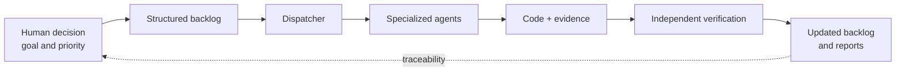
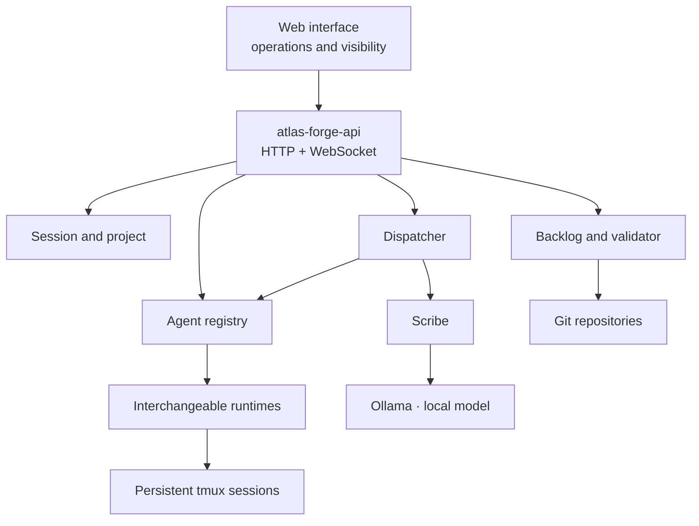
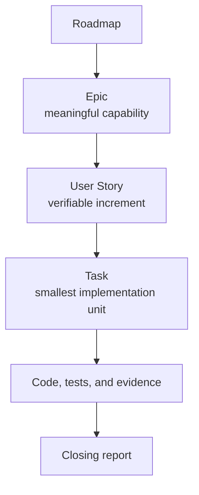
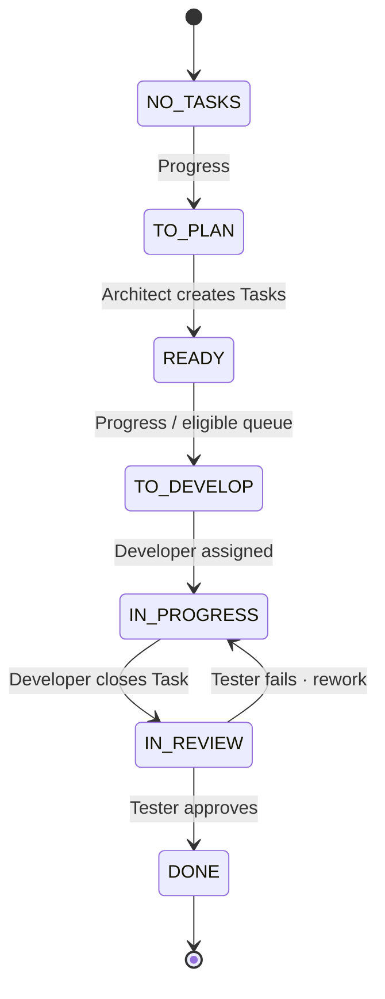
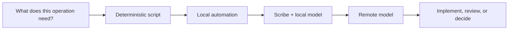
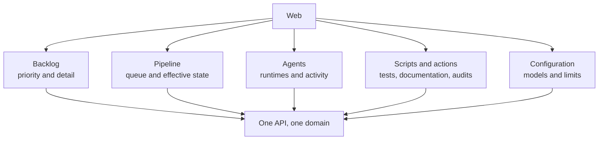

# Vibe coding without losing control: Atlas Forge and the backlog-governed software factory

*Atlas Forge presentation article · version 0.9*

---

Vibe coding comes with an irresistible promise: describe an intention, let an agent write the code, and within minutes something works. It is a wonderful experience; it can also be a trap. Generation speed is no longer the bottleneck. The bottleneck is knowing what has been built, why, with what evidence, and what remains to be done.

Atlas Forge exists to resolve that tension: preserve the speed of agents without giving up the governance of an engineering project. It is not trying to be another editor, chatbot, or runtime. It is the layer that turns defined work into executable, verifiable work.

> **Core idea:** Atlas Forge automates the execution of work, not the decision about which work is worth doing.

**Official repository:** [github.com/Yokosillo/atlas-forge](https://github.com/Yokosillo/atlas-forge)

## The problem is not that AI writes code. It is that nobody is directing the work.

When teams work with isolated agents, the pattern repeats itself. Context must be remembered in every conversation, the right session must be picked by hand, priorities must be reconstructed, results must be chased down, and every “done” must be judged for credibility. Code arrives quickly; understanding the system does not.

The consequence is not only technical debt. Coordination debt appears too:

- work does not always have a clear business unit;
- context ends up spread across terminals, chats, and human memory;
- the person implementing is often the one claiming everything is fine;
- changes that are hard to trace become hard to review;
- remote models are spent on work that a script could handle more reliably and cheaply.

The developer stops directing the product and starts refereeing a collection of processes. What looks like autonomy is often manual coordination work disguised as speed.

## The hypothesis: agents do not lack intelligence; they lack a system

Agents are already remarkably good at reading repositories, writing changes, and running tests. But they should not implicitly decide the scope, priority, or acceptance criteria of a project. Those are product and engineering decisions that need explicit structure.

Atlas Forge places that structure around real runtimes—Claude Code, OpenCode, and Codex—and treats them for what they are: interchangeable executors. The system provides what is missing between a human intention and a reliable code change:

1. **Work is defined before it is implemented.**
2. **Every change is traceable back to a decision.**
3. **Implementation is verified independently.**
4. **Deterministic automation is used wherever an LLM adds no value.**
5. **There is one operational view of the project, agents, and pipeline.**



This is not bureaucracy added to AI. It is the minimum control system needed to use it at speed without losing the ability to explain what is happening.

## What Atlas Forge is

Atlas Forge is a coordination platform for AI-assisted software development. It discovers Git repositories, maintains an active project, runs agents in persistent `tmux` sessions, sends them work, observes their status, and governs a backlog-based pipeline.

Its architecture is deliberately straightforward: one source-of-truth process, `atlas-forge-api`, exposes the HTTP/WebSocket API and serves the web interface. The web contains no business logic; it operates the domain through that API. This creates one unambiguous place to observe the system and prevents each client from inventing its own version of reality.



The key word is **coordination**. Atlas Forge does not compete with Jira or Linear: those systems describe work for human teams. Nor does it compete with Claude Code, Codex, or OpenCode: it uses them. Its place is between the two: it turns a backlog into an operational sequence of implementation, testing, verdicts, and reports.

## The backlog stops being a list and becomes a control panel

In Atlas Forge, the backlog is not a planning note forgotten in another tool. It is the operational contract for work. Its hierarchy is deliberately simple:



Every Task declares its goal, acceptance criteria, dependencies, and state. Every implementation can be traced back to its Task; every verification to the agreed criteria. The backlog is versioned as structured Markdown, while the interface lets an operator create and advance work without turning them into a file editor.

The result is a subtle but essential difference: rather than “asking an agent for something and waiting,” a work item with identity, scope, dependencies, and a definition of done is progressed.

## The pipeline: visible progress, derived states, and no promotion by intuition

A new User Story starts without Tasks. From the web, a single action—**Progress**—asks the Architect to break it down. Once valid Tasks exist, the Story’s state is derived from its least advanced Task; it is not a decorative label someone updates by guesswork.



The diagram simplifies an important distinction: `IN_REVIEW` does not mean the same thing at both levels. For a **Task**, it means “a Tester must check the criteria and evidence.” For a **User Story**, it only appears when every Task is `DONE`, and means “the Architect must validate that the whole set really covers the need.” Only that final verdict takes the Story to `DONE`.

```mermaid
sequenceDiagram
    participant P as Operator
    participant B as Backlog + Dispatcher
    participant AR as Architect
    participant DE as Developer
    participant TE as Tester

    P->>B: Progress a Story without Tasks
    B->>AR: Break Story down into Tasks
    AR-->>B: Validated, traceable Tasks
    B->>DE: Assign eligible Task
    DE-->>B: Implementation + Task closure
    B->>TE: Criteria + diff + Developer report
    alt Success
        TE-->>B: Task DONE
    else Failure
        TE-->>B: Finding; same Task returns for rework
        B->>DE: Fix with priority
    end
    B->>AR: All Tasks DONE · validate Story coverage
    AR-->>B: Approved, or add a Task for a detected gap
```

This design avoids two common anti-patterns: the same agent granting itself approval, and every defect creating an improvised new task. When a Task fails, it returns to the Developer who closed it when available; otherwise, the system returns it to the development flow without blocking the project.

## Adversarial verification: two questions, two responsibilities

Independence is not a ceremony. It is a practical way to reduce the probability that a convincing claim substitutes for real evidence.

| Role | Question it answers | Evidence it uses |
|---|---|---|
| **Developer** | “Have I built the Task?” | Code, tests, and work closure. |
| **Tester** | “Does this Task meet its criteria?” | Acceptance criteria, `git diff`, changed files, and the Developer report. |
| **Architect** | “Do the Tasks solve the complete Story?” | Need coverage, coherence with the Epic, and scope gaps. |

The Tester does not decide the architecture or expand scope. The Architect does not mechanically repeat every functional test. Each role reviews something different and complementary. That separation makes the final verdict more useful than a simple “looks good.”

## Deterministic first: reserve expensive reasoning for difficult reasoning

One operating principle runs through Atlas Forge: before querying a remote model, ask whether the problem is better solved by a rule, validator, or script.



Format and transition validators, state management, tests, project scripts, and status reads should not consume remote reasoning. For context, summaries, and indexing, **Scribe** can use a local model through Ollama; it is optional and degrades explicitly when unavailable. Remote runtimes are reserved for work that actually needs judgement: implementation, research, review, or proposals.

This is not only about saving tokens. It improves predictability: a deterministic procedure is easier to repeat, debug, and audit than an open-ended instruction to a model.

## Context that survives a Job, operations that survive complexity

Each agent runs on a real runtime in its own `tmux` session. That session persists between Jobs, letting the agent retain operational context rather than starting from scratch on every assignment. The system supports Claude Code, OpenCode, and Codex, with runtime and model selection based on the available configuration.

Atlas Forge also keeps a per-project dispatch queue, Job history, and closing reports in the repository. The queue provides order and auditability; the backlog files remain the source of truth for work eligibility and state.

There is an important note of technical honesty: the active project and preferences persist on disk, but the state of sessions, agents, and Jobs currently lives in process memory. On backend restart, the active project is recovered and the session is rebuilt; there is no claim of magical memory that does not yet exist. Designing with that clarity is part of the governance Atlas Forge advocates.

## The web interface is not a mockup: it is the command post

The web is the main client and lets users see and operate the complete system: Backlog, Pipeline, Agents, Architect, Scripts, and Configuration. The dispatch queue updates in real time; agent panels can show activity; scripts and cross-cutting actions turn repeatable operations—testing, documenting, analyzing architecture, or auditing—into observable actions.



The goal is not centralization for its own sake. It is to reduce the cognitive cost of operating a system with several agents: one person should be able to answer “what is blocked, who is working on what, and what evidence exists?” without visiting five tools and three terminals.

## What works today—and what should not be sold ahead of time

In version 0.9, the state-driven backlog, the Developer → Tester → Architect pipeline with rework, the Epic → User Story → Task generators, Claude Code/OpenCode/Codex runtimes, per-project sessions, restart reconciliation, web activity visibility, scripts, and optional local Scribe are already operational.

The later roadmap has concrete ambitions: operational auditing, a researcher role, a Documenter integrated into the pipeline, structured telemetry, context and knowledge management, capabilities, and more declarative automation. It is important to state this precisely: there is no plugin system or MCP yet, nor an operational Capability Engine. Atlas Forge does not need to exaggerate what it is; its value is that the core already works.

## Conclusion: control does not slow speed; it prevents it from being an illusion

Vibe coding does not have to mean improvisation. The energy of describing an idea and seeing it rapidly become software is valuable. But when a project matters, that energy needs a system that makes decisions, boundaries, and proof visible.

Atlas Forge offers a straightforward answer: define the work, delegate its execution, verify it through an independent role, and preserve the trail. That lets agents work quickly without forcing the team to guess what they did or accept their own definition of “done.”

The factory does not replace the developer. It gives them back their rightful place: deciding the direction, not chasing every spark.

---

*Atlas Forge — coordination for AI-assisted software development. Executable backlog, independent verification, and deterministic automation first.*
