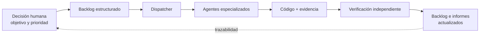
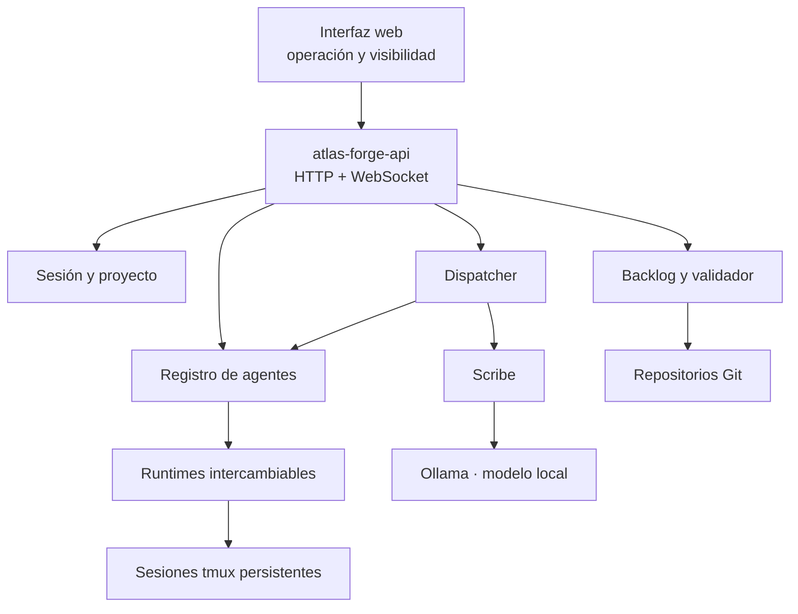
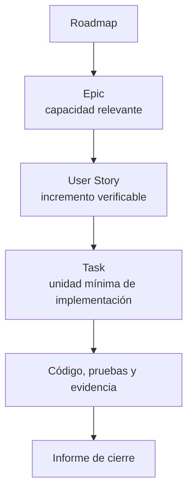
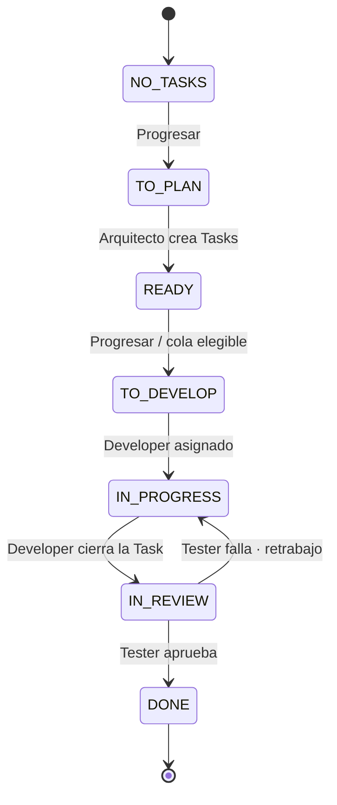
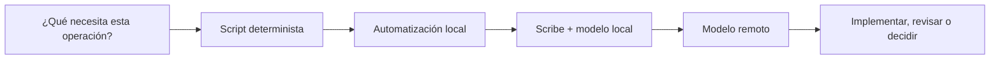
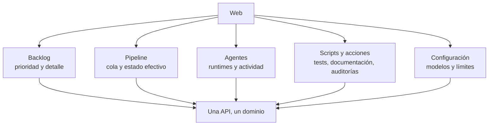

# Vibe coding sin perder el control: Atlas Forge y la fábrica de software gobernada por backlog

*Artículo de presentación de Atlas Forge · versión 0.9*

---

El *vibe coding* tiene una promesa irresistible: describes una intención, un agente escribe código y, en cuestión de minutos, algo funciona. Es una experiencia magnífica; también puede ser una trampa. La velocidad de generación ha dejado de ser el cuello de botella. El cuello de botella ahora es saber qué se ha construido, por qué, con qué evidencia y qué queda por hacer.

Atlas Forge nace para resolver precisamente esa tensión: conservar la velocidad de los agentes sin renunciar al gobierno de un proyecto de ingeniería. No intenta ser otro editor, otro chatbot ni otro runtime. Es la capa que convierte trabajo definido en trabajo ejecutable y verificable.

> **Idea fuerza:** Atlas Forge automatiza la ejecución del trabajo, no la decisión sobre qué trabajo merece hacerse.

**Repositorio oficial:** [github.com/Yokosillo/atlas-forge](https://github.com/Yokosillo/atlas-forge)

## El problema no es que la IA escriba código. Es que nadie dirija la obra

Cuando se trabaja con agentes aislados, el patrón se repite. Hay que recordar el contexto en cada conversación, elegir manualmente qué sesión usar, reconstruir prioridades, perseguir resultados y decidir si un “terminado” merece confianza. El código llega deprisa; la comprensión del sistema, no tanto.

La consecuencia no es solo deuda técnica. También aparece una deuda de coordinación:

- el trabajo no siempre tiene una unidad de negocio clara;
- el contexto acaba repartido entre terminales, chats y memoria humana;
- quien implementa suele ser quien afirma que todo está bien;
- los cambios difíciles de rastrear se vuelven difíciles de revisar;
- se consumen modelos remotos para tareas que un script podía resolver de forma más fiable y barata.

El desarrollador deja de dirigir el producto y empieza a arbitrar una colección de procesos. Lo que parece autonomía es, muchas veces, trabajo manual de coordinación disfrazado de velocidad.

## La hipótesis: a los agentes no les falta inteligencia; les falta un sistema

Los agentes ya son extraordinariamente buenos leyendo repositorios, escribiendo cambios y ejecutando pruebas. Pero no deberían decidir de manera implícita el alcance, la prioridad ni el criterio de aceptación de un proyecto. Esas son decisiones de producto e ingeniería que necesitan una estructura explícita.

Atlas Forge pone esa estructura alrededor de runtimes reales —Claude Code, OpenCode y Codex— y los trata como lo que son: ejecutores intercambiables. El sistema aporta lo que falta entre una intención humana y un cambio de código fiable:

1. **Trabajo definido antes de implementarse.**
2. **Trazabilidad desde la decisión hasta el cambio.**
3. **Verificación independiente de quien implementa.**
4. **Automatización determinista allí donde un LLM no añade valor.**
5. **Una vista operativa única del proyecto, los agentes y el pipeline.**



No es burocracia añadida a la IA. Es el mínimo sistema de control que permite usarla a velocidad sin perder la capacidad de explicar qué está ocurriendo.

## Qué es Atlas Forge

Atlas Forge es una plataforma de coordinación para desarrollo asistido por IA. Descubre repositorios Git, mantiene un proyecto activo, lanza agentes en sesiones persistentes de `tmux`, les envía trabajo, observa su estado y gobierna un pipeline basado en backlog.

Su arquitectura es deliberadamente sobria: un único proceso de verdad, `atlas-forge-api`, expone la API HTTP/WebSocket y sirve la interfaz web. La web no contiene lógica de negocio; opera el dominio a través de esa API. Esto da un lugar inequívoco para observar el sistema y evita que cada cliente invente su propia versión de la realidad.



La palabra importante aquí es **coordinación**. Atlas Forge no compite con Jira o Linear: esos sistemas describen trabajo para equipos humanos. Tampoco compite con Claude Code, Codex u OpenCode: los utiliza. Su espacio está entre ambos: convierte un backlog en una secuencia operativa de implementación, pruebas, veredicto e informes.

## El backlog deja de ser una lista y se convierte en un panel de control

En Atlas Forge, el backlog no es una nota de planificación olvidada en otra herramienta. Es el contrato operativo del trabajo. La jerarquía es deliberadamente simple:



Cada Task declara objetivo, criterios de aceptación, dependencias y estado. Cada implementación se puede remontar a su Task; cada verificación, a los criterios acordados. El backlog está versionado como Markdown estructurado, pero la interfaz permite crear y conducir el trabajo sin convertir a la persona operadora en editora de ficheros.

El resultado es una diferencia sutil pero esencial: no se “pide algo a un agente y se espera”. Se hace progresar una pieza de trabajo con identidad, alcance, dependencias y definición de terminado.

## El pipeline: progreso visible, estados derivados y ninguna promoción por intuición

Una User Story nueva empieza sin Tasks. Desde la web, una única acción —**Progresar**— solicita que el Arquitecto la aterrice. Cuando existen Tasks válidas, el estado de la Story se deriva de la Task menos avanzada; no es una etiqueta decorativa que alguien actualiza a ojo.



La imagen simplifica una distinción importante: `IN_REVIEW` no significa lo mismo en los dos niveles. En una **Task**, significa “un Tester debe comprobar los criterios y la evidencia”. En una **User Story**, solo aparece cuando todas sus Tasks están en `DONE`, y significa “el Arquitecto debe validar que el conjunto cubre realmente la necesidad”. Solo ese veredicto final lleva la Story a `DONE`.

```mermaid
sequenceDiagram
    participant P as Persona operadora
    participant B as Backlog + Dispatcher
    participant AR as Arquitecto
    participant DE as Developer
    participant TE as Tester

    P->>B: Progresar una Story sin Tasks
    B->>AR: Aterrizar Story en Tasks
    AR-->>B: Tasks validadas y trazables
    B->>DE: Asignar Task elegible
    DE-->>B: Implementación + cierre de Task
    B->>TE: Criterios + diff + informe del Developer
    alt Éxito
        TE-->>B: Task DONE
    else Fallo
        TE-->>B: Hallazgo; misma Task vuelve a retrabajo
        B->>DE: Corregir con prioridad
    end
    B->>AR: Todas las Tasks DONE · validar cobertura de la Story
    AR-->>B: Aprobada o nueva Task por hueco detectado
```

Este diseño evita dos anti-patrones habituales: que el mismo agente se otorgue el aprobado y que cada error cree una nueva tarea improvisada. Si una Task falla, vuelve al Developer que la cerró cuando está disponible; si no lo está, el sistema la devuelve al flujo de desarrollo sin bloquear el proyecto.

## Verificación adversarial: dos preguntas, dos responsabilidades

La independencia no es una ceremonia. Es una manera práctica de reducir la probabilidad de que una afirmación convincente sustituya a una evidencia real.

| Rol | Pregunta que responde | Evidencia que usa |
|---|---|---|
| **Developer** | “¿He construido la Task?” | Código, pruebas y cierre del trabajo. |
| **Tester** | “¿Cumple esta Task sus criterios?” | Criterios de aceptación, `git diff`, archivos modificados e informe del Developer. |
| **Arquitecto** | “¿Las Tasks resuelven la Story completa?” | Cobertura de necesidad, coherencia con la Epic y huecos de alcance. |

El Tester no decide la arquitectura ni amplía el alcance. El Arquitecto no repite mecánicamente cada prueba funcional. Cada rol revisa algo distinto y complementario. Esa división hace que el veredicto final sea más útil que un simple “parece bien”.

## Determinista primero: reservar el razonamiento caro para el razonamiento difícil

Un principio operativo atraviesa Atlas Forge: antes de consultar un modelo remoto, hay que preguntarse si el problema se resuelve mejor con una regla, un validador o un script.



Los validadores de formato y transiciones, la gestión de estados, los tests, los scripts de proyecto y la lectura de estado no deberían consumir razonamiento remoto. Para contexto, resúmenes e indexación, **Scribe** puede usar un modelo local mediante Ollama; es opcional y degrada de forma explícita si no está disponible. Los runtimes remotos quedan para aquello que sí requiere criterio: implementar, investigar, revisar o proponer.

No se trata solo de ahorrar tokens. Se trata de mejorar la previsibilidad: un procedimiento determinista es más fácil de repetir, depurar y auditar que una instrucción abierta a un modelo.

## Contexto que sobrevive al Job, operación que sobrevive a la complejidad

Cada agente se ejecuta sobre un runtime real en su propia sesión de `tmux`. Esa sesión persiste entre Jobs: el agente puede conservar contexto operativo en vez de empezar desde cero en cada encargo. El sistema admite Claude Code, OpenCode y Codex, con selección de runtime y modelo según la configuración disponible.

Atlas Forge también conserva una cola de despacho por proyecto, historial de Jobs e informes de cierre en el repositorio. La cola aporta orden y auditoría; los ficheros del backlog continúan siendo la fuente de verdad para la elegibilidad y el estado del trabajo.

Hay un matiz importante de honestidad técnica: el proyecto activo y las preferencias se persisten en disco, pero el estado de sesión, agentes y Jobs vive actualmente en memoria del proceso. Al reiniciar el backend se recupera el proyecto activo y se reconstruye la sesión; no se debe prometer una memoria mágica que todavía no existe. Diseñar con esta claridad es parte del gobierno que Atlas Forge propone.

## La interfaz web no es una maqueta: es el puesto de mando

La web es el cliente principal y permite ver y operar el sistema completo: Backlog, Pipeline, Agentes, Arquitecto, Scripts y Configuración. La cola de despacho se actualiza en tiempo real; los paneles de agente pueden mostrar actividad; los scripts y acciones transversales convierten operaciones repetibles —probar, documentar, analizar arquitectura o auditar— en acciones observables.



La intención no es centralizar por estética. Es reducir el coste mental de operar un sistema con varios agentes: una persona debe poder responder “qué está bloqueado, quién trabaja en qué y qué evidencia hay” sin recorrer cinco herramientas y tres terminales.

## Qué está operativo hoy y qué no conviene vender antes de tiempo

En la versión 0.9 ya están operativos el backlog guiado por estados, el pipeline Developer → Tester → Arquitecto con retrabajo, los generadores Epic → User Story → Task, los runtimes Claude Code/OpenCode/Codex, sesiones por proyecto, reconciliación tras reinicios, visualización de actividad en la web, scripts y Scribe local opcional.

El roadmap posterior tiene ambición concreta: auditoría operativa, rol investigador, Documentador integrado en el pipeline, telemetría estructurada, gestión de contexto y conocimiento, capacidades y automatización más declarativa. Es importante decirlo con precisión: no hay todavía sistema de plugins ni MCP, ni un Capability Engine operativo. Atlas Forge no necesita exagerar lo que es; su valor está en que la parte fundamental ya funciona.

## Conclusión: el control no frena la velocidad; evita que sea ilusoria

El *vibe coding* no tiene por qué ser sinónimo de improvisación. La energía de describir una idea y verla convertirse rápidamente en software es valiosa. Pero, cuando el proyecto importa, esa energía necesita un sistema que haga visibles las decisiones, los límites y las pruebas.

Atlas Forge propone una respuesta sencilla: definir el trabajo, delegar su ejecución, verificarlo desde un rol independiente y conservar el rastro. Así los agentes pueden trabajar rápido sin que el equipo tenga que adivinar qué hicieron ni aceptar su propia versión de “terminado”.

La fábrica no sustituye al desarrollador. Le devuelve el lugar que le corresponde: decidir el rumbo, no perseguir cada chispazo.

---

*Atlas Forge — coordinación de desarrollo de software asistido por IA. Backlog ejecutable, verificación independiente y automatización determinista primero.*

