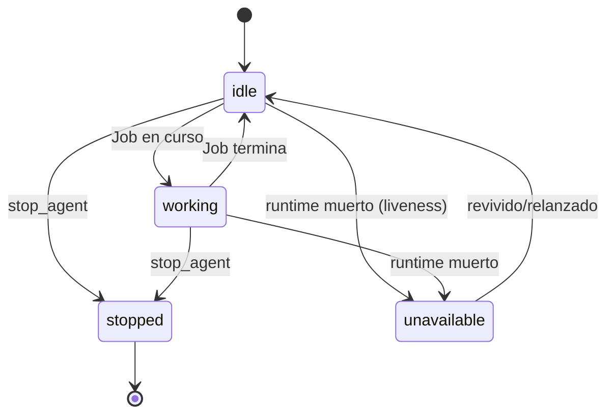

# Agentes

Los agentes son la unidad fundamental de trabajo. Un agente = **rol** + **prompt** + **runtime** + **sesión tmux** + **estado**. No son modelos de lenguaje ni procesos genéricos.

## Roles registrados

Factory Brain usa un **registro centralizado de roles** (`brain/agents/roles.py`) donde cada rol declara: prompt base, fichero de gobernanza, builder de prompt y función de registro. Los roles se registran en import-time al importar `brain.agents`.

| Rol | Gobernanza | Comportamiento |
|---|---|---|
| **`developer`** | `developer.md` | Implementa User Stories. Siempre crea una instancia nueva (paralelismo permitido, máximo **3** Developers simultáneos); auto-nombrado `Developer-1`, `Developer-2`… |
| **`critic`** | `CRITICO.md` | Rol reutilizable: revisa trabajo. Antecedente del Arquitecto (FB-022 renombró Crítico→Arquitecto). |
| **`director`** | `DIRECTOR.md` | Rol reutilizable, **conversacional**: conversa con el humano sobre Epics existentes (solo lectura del backlog; no modifica ficheros, no valida trabajo del Developer). |
| **`arquitecto`** | `ARQUITECTO.md` | Rol reutilizable, **doble función**: aterriza backlog (genera Epic→US→Task con formato estándar) y emite **veredictos** estructurados (`APROBADO` / `APROBADO_CON_OBSERVACIONES` / `RECHAZADO`) sobre el trabajo del Developer. |

!!! note "Tester"
    El rol **Tester no está registrado todavía** en el backend (no existe `agents/tester.py`). Sí existe su *contrato de entrada/salida* (`dispatcher/tester_input.py`: empaqueta criterios de aceptación + diff de código para un Job de Tester) y aparece en la configuración de roles de la web con modelo por defecto. El registro del agente Tester es trabajo futuro.

## Prompts: dos capas (rol base + gobierno del proyecto)

El prompt inicial de un agente se construye en dos capas, ambas decididas por Factory Brain (nunca por el agente):

1. **Rol base** (código): responsabilidad y límites + protocolo de reporte genérico.
2. **Gobierno específico del proyecto**: si el proyecto activo declara `00-gobierno/<rol>.md` + `00-gobierno/METODOLOGIA.md`, se añade una instrucción explícita para que el agente los lea. Un proyecto sin esa convención no degrada el comportamiento (solo carece de la capa adicional).

## Lanzamiento

`launch_agent(role, runtime_type, model, session, project_path, socket_name)` valida en orden: sesión activa → rol conocido → runtime conocido (`claude-code` | `opencode`) → modelo solo permitido para OpenCode. Si el rol es reutilizable y ya hay un agente vivo (`idle`/`working`) de ese rol, se **reutiliza** en vez de duplicar; si está `stopped`/`unavailable`, se sustituye por uno nuevo.

Con `initial_job_description`, además del lanzamiento se crea y despacha un Job inicial de bloqueo (`launch_agent_with_initial_job`); un fallo de despacho deja el Job `failed` con motivo en `job.result` pero **no des-registra** el agente.

## Ciclo de vida

- `stopped` = parada intencional del humano (terminal; hay que relanzar).
- `unavailable` = fallo no solicitado (runtime muerto).
- El **liveness se comprueba de forma perezosa** al consultar `GET /agents` (`refresh_agent_liveness`): si el runtime está muerto y el estado era `idle`/`working`, transiciona a `unavailable`. No hay polling en segundo plano.

## Reutilización

`register_agent_with_reuse` busca un agente existente del mismo rol en la sesión. La reutilización se aplica a Critic/Director/Arquitecto (agentes conversacionales persistentes); el Developer siempre crea una instancia nueva (hasta 3 simultáneos). Motivo: `_find_agent_by_role` elige el primer agente de un rol — la sustitución (no coexistencia) evita que un agente detenido de un rol bloquee el enrutado.

## Registro runtime↔agente

`agent_runtime_registry` asocia `agent_id → RuntimeInstance` (proceso-scoped). El lanzamiento lo registra; `stop_agent` y el liveness lo consultan. `stop_agent` mata primero la sesión tmux y luego transiciona a `stopped` (nunca a `unavailable`).

## Catálogo de opciones de lanzamiento

`GET /agents/options` (y `list_available_agent_options` en el dominio) genera el producto cartesiano **roles × modelos habilitados**, con el runtime resuelto automáticamente desde el catálogo de modelos. `supports_model` indica si ese modelo admite cambio en caliente (solo OpenCode). La API filtra las combinaciones Critic+OpenCode (decisión de producto).

## Gobernanza

`project_has_governance(project, role)` comprueba en disco que existan `00-gobierno/<rol>.md` y `00-gobierno/METODOLOGIA.md`. `project_governance_instruction(...)` devuelve la instrucción a añadir al prompt (o cadena vacía). Ver `00-gobierno/` del proyecto para los ficheros reales: `ARQUITECTO.md`, `CRITICO.md`, `DIRECTOR.md`, `developer.md`, `METODOLOGIA.md`, `UX.md`, `DOCUMENTADOR.md`, `AUDITOR-OSS.md`.

## Planificado (no implementado)

- **Flag `persistent` por rol** (FB-023): Director/Arquitecto persistentes; Developer/Tester mueren al terminar. No existe en el modelo `Agent` todavía.
- **Detección de agentes colgados y recuperación automática** (FB-023): pendiente.
- **Rol Tester** (FB-022/23): pendiente de registro.
- **Declaración de capacidades de agente** (US-FB005-03): bloqueada hasta el Capability Engine (FB-010).
