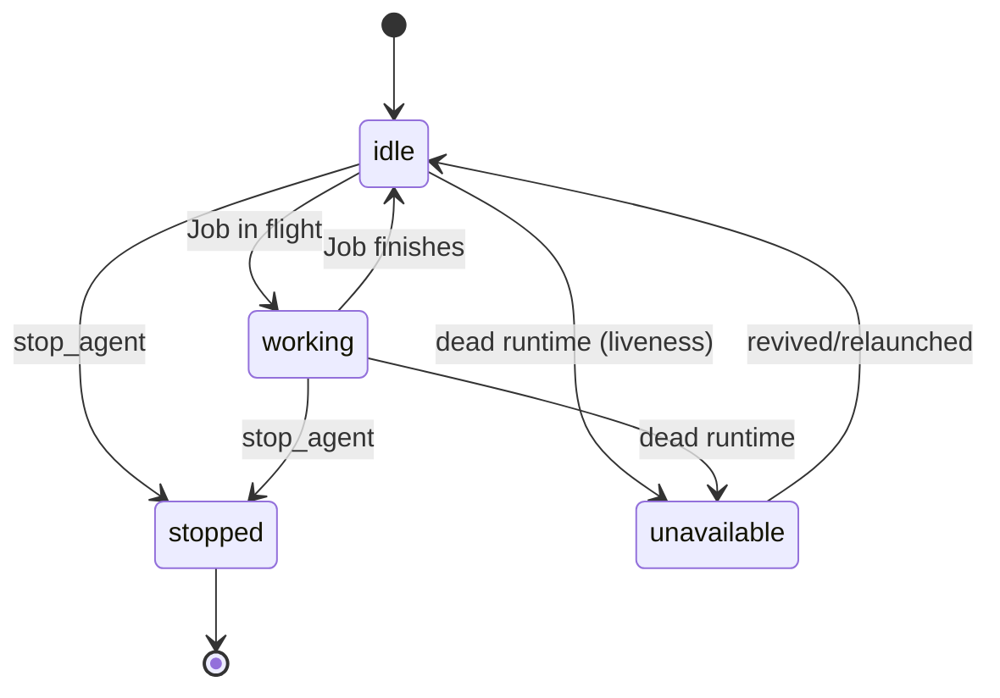

# Agents

Agents are the fundamental unit of work. An agent = **role** + **prompt** + **runtime** + **tmux session** + **state**. They are not language models nor generic processes.

In the backlog-centric pipeline, agents are roles orchestrated by the product (Director, Architect, Developer, Tester) rather than launched one by one by hand: the product decides who runs each step of a plan.

## Registered roles

Factory Brain uses a **centralized role registry** (`brain/agents/roles.py`) where each role declares: base prompt, governance file, prompt builder and registration function. Roles are registered at import-time when importing `brain.agents`.

| Role | Governance | Behavior |
|---|---|---|
| **`developer`** | `developer.md` | Implements User Stories. Always creates a new instance (parallelism allowed, max **3** simultaneous Developers); self-named `Developer-1`, `Developer-2`… |
| **`critic`** | `CRITICO.md` | Reusable role: reviews work. Predecessor of the Architect (FB-022 renamed Critic→Architect). |
| **`director`** | `DIRECTOR.md` | Reusable, **conversational** role: converses with the human about existing Epics (read-only on the backlog; does not modify files, does not validate Developer work). |
| **`arquitecto`** | `ARQUITECTO.md` | Reusable, **dual-function** role: lands the backlog (generates Epic→US→Task in standard format) and issues structured **verdicts** (`APROBADO` / `APROBADO_CON_OBSERVACIONES` / `RECHAZADO`) on Developer work. |

!!! note "Tester"
    The **Tester role is not yet registered** in the backend (there is no `agents/tester.py`). Its *input/output contract* does exist (`dispatcher/tester_input.py`: packages acceptance criteria + code diff for a Tester Job) and it appears in the web role configuration with a default model. Registering the Tester agent is future work.

## Prompts: two layers (base role + project governance)

The initial prompt of an agent is built in two layers, both decided by Factory Brain (never by the agent):

1. **Base role** (code): responsibility and limits + generic reporting protocol.
2. **Project-specific governance**: if the active project declares `00-gobierno/<role>.md` + `00-gobierno/METODOLOGIA.md`, an explicit instruction is added telling the agent to read them. A project without that convention does not degrade behavior (it just lacks the extra layer).

## Launching

`launch_agent(role, runtime_type, model, session, project_path, socket_name)` validates in order: active session → known role → known runtime (`claude-code` | `opencode`) → model only allowed for OpenCode. If the role is reusable and there is already a live agent (`idle`/`working`) of that role, it is **reused** instead of duplicated; if it is `stopped`/`unavailable`, it is replaced with a new one.

With `initial_job_description`, besides launching, an initial blocking Job is created and dispatched (`launch_agent_with_initial_job`); a dispatch failure leaves the Job `failed` with the reason in `job.result` but does **not** un-register the agent.

## Lifecycle

- `stopped` = intentional human stop (terminal; must relaunch).
- `unavailable` = unsolicited failure (dead runtime).
- **Liveness is checked lazily** when querying `GET /agents` (`refresh_agent_liveness`): if the runtime is dead and the state was `idle`/`working`, it transitions to `unavailable`. No background polling.

## Reuse

`register_agent_with_reuse` looks for an existing agent of the same role in the session. Reuse applies to Critic/Director/Architect (persistent conversational agents); the Developer always creates a new instance (up to 3 simultaneous). Reason: `_find_agent_by_role` picks the first agent of a role — substitution (not coexistence) avoids a stopped agent of a role blocking routing.

## Runtime↔agent registry

`agent_runtime_registry` maps `agent_id → RuntimeInstance` (process-scoped). Launching registers it; `stop_agent` and liveness consult it. `stop_agent` first kills the tmux session and then transitions to `stopped` (never to `unavailable`).

## Launch options catalog

`GET /agents/options` (and `list_available_agent_options` in the domain) generates the **roles × enabled models** Cartesian product, with the runtime resolved automatically from the model catalog. `supports_model` indicates whether that model supports hot model switching (OpenCode only). The API filters Critic+OpenCode combinations (product decision).

## Governance

`project_has_governance(project, role)` checks on disk that `00-gobierno/<role>.md` and `00-gobierno/METODOLOGIA.md` exist. `project_governance_instruction(...)` returns the instruction to add to the prompt (or empty string). See the project's `00-gobierno/` for the real files: `ARQUITECTO.md`, `CRITICO.md`, `DIRECTOR.md`, `developer.md`, `METODOLOGIA.md`, `UX.md`, `DOCUMENTADOR.md`, `AUDITOR-OSS.md`.

## Planned (not implemented)

- **`persistent` flag per role** (FB-023): Director/Architect persistent; Developer/Tester die when finished. Not yet in the `Agent` model.
- **Stuck-agent detection and automatic recovery** (FB-023): pending.
- **Tester role** (FB-022/23): pending registration.
- **Agent capability declaration** (US-FB005-03): blocked until the Capability Engine (FB-010).
