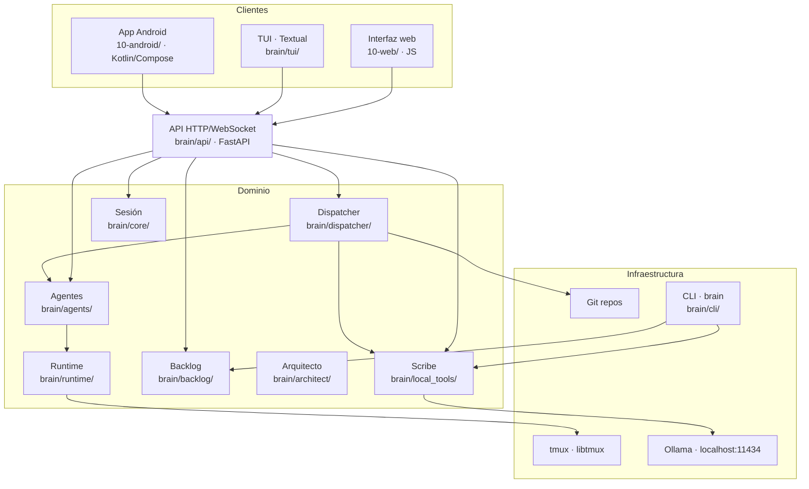

# Arquitectura

Factory Brain es una aplicación **modular, extensible y mantenible**, diseñada para incorporar nuevas capacidades sin reestructurar el proyecto.

## Idea central

El dominio (proyectos, sesiones, agentes, Jobs, planes, backlog) vive **detrás de una única API HTTP/WebSocket** (`brain/api/`, FastAPI). Ningún cliente accede al dominio de otra forma que no sea esa API — incluida la propia TUI, que es un cliente HTTP como cualquier otro.

> Un proceso de verdad (`brain-api`), tres clientes: **interfaz web**, **TUI** y **app Android**.

## Capas



### Presentación

Interfaz web (JS puro servida por el propio backend en `/ui/`), TUI (Textual) y app Android (Kotlin/Compose). **Sin lógica de negocio**: toda la interacción pasa por la API.

### Aplicación

La API (`brain/api/routes.py`) orquesta operaciones: lanza agentes, crea/despacha Jobs, gestiona planes, ejecuta scripts y expone el estado del backlog. Es una capa fina sobre el dominio — no reimplementa lógica, la expone.

### Dominio

Reglas de negocio independientes de la interfaz:

- **`brain/core/`** — ciclo de vida de la sesión de desarrollo.
- **`brain/agents/`** — registro de roles, lanzamiento, ciclo de vida, liveness, parada, gobernanza.
- **`brain/runtime/`** — instancias de runtime en tmux (Claude Code, OpenCode).
- **`brain/dispatcher/`** — creación, despacho, reporte, cancelación de Jobs; planes del Arquitecto; veredictos; disparo automático de Scribe; cola FIFO de veredictos.
- **`brain/backlog/`** — parser del backlog, informe de estado, detalle, validador, grafo de dependencias.
- **`brain/architect/`** — generadores Epic→US→Task, revisión de huecos, pipelines con autoauditoría.
- **`brain/local_tools/`** — Scribe (resumen/indexación local vía Ollama).
- **`brain/workspace/`** — descubrimiento de proyectos, proyecto activo, scripts genéricos y del proyecto, arranque.
- **`brain/models/`** — dataclasses del dominio (Agent, Job, JobPlan, DevelopmentSession, Project, backlog, scripts).

### Infraestructura

- **tmux** (socket `factory-brain`) para sesiones de runtime persistentes.
- **Git** para descubrir repositorios y ejecutar scripts.
- **Ollama** para Scribe.
- **systemd** para el servicio `brain-api`.

## Persistencia

| Dato | Dónde | Persistente |
|---|---|---|
| Proyecto activo | `~/.local/share/brain/active_project.json` | Sí |
| Preferencias de modelos | `~/.local/share/brain/model_preferences.json` | Sí |
| Sesión, agentes, Jobs, planes | En memoria de `brain-api` | No |
| Informes de cierre | `07-informes/<US>/<job_id>.md` | Sí (ficheros) |
| Backlog | `02-backlog/` del proyecto activo | Sí (ficheros Markdown) |

## Diseño de detalle por módulo

### Sesión de desarrollo (`brain/core/`)

Una sesión representa un entorno persistente de trabajo sobre un proyecto. Estados: `created` → `active` → `closed`. Se crea al seleccionar un proyecto y se cierra al cambiar de proyecto (deteniendo antes los agentes no detenidos).

### Runtimes (`brain/runtime/`)

Cada agente lanzado es una **instancia de runtime** en una sesión tmux propia (`runtime/agent_model.py`):
- **Claude Code**: `claude --dangerously-skip-permissions` + prompt como argumento posicional.
- **OpenCode**: `opencode --auto [--model provider/model]` + `--prompt "..."`.

El registro `agent_runtime_registry` asocia `agent_id → RuntimeInstance`. El liveness se comprueba de forma perezosa al consultar (no polling).

### Agentes (`brain/agents/`)

Roles registrados (4): `developer`, `critic`, `director`, `arquitecto`. Cada rol define prompt base + fichero de gobernanza + función de registro. Ver [Agentes](agents.md).

### Dispatcher (`brain/dispatcher/`)

- **Job**: `create → running → {completed | failed | cancelled}`. El reporte del resultado es **cooperativo**: el agente escribe su resultado en un fichero temporal y una marca final; el dispatcher espera ese fichero.
- **Encadenado**: `previous_job` inyecta literalmente el resultado del Job anterior en la descripción del siguiente. Developer→Developer está bloqueado (debe pasar por Critic/Arquitecto).
- **Plan**: el Arquitecto propone una secuencia de pasos (`proposed`), el humano aprueba una vez (`approved`) y se despacha de extremo a extremo. Estados: `proposed → {approved, rejected}`, `approved → {blocked, cancelled}`.
- **Scribe automático**: el dispatcher decide invocar a Scribe (por tamaño de descripción > 4000 caracteres o por ≥ 10 Jobs consecutivos) para pre-procesar contexto, ahorrando tokens del runtime remoto.
- **Veredicto**: tras despachar un plan, se encola un Job de veredicto al Arquitecto (cola FIFO, un worker) que emite `APROBADO` / `APROBADO_CON_OBSERVACIONES` / `RECHAZADO` y, si se aprueba, marca las Tasks como `DONE`.

### Backlog (`brain/backlog/`)

Parser determinista de `02-backlog/` (Epics, User Stories, Tasks) → grafo de items con estado, dependencias, prioridad y fase. Informe de estado (`build_backlog_report`) con conteos por Epic, items LISTA/BLOQUEADA, cadena de máximo apalancamiento y grado de desbloqueo. Validador de formato del esquema del backlog.

### API (`brain/api/`)

FastAPI con ~30 endpoints REST + 2 WebSockets (`/ws/jobs`, `/ws/plans`), static `/ui/`, `/health` y `/apk`. Sin autenticación propia (perímetro Tailscale). Ver [API](api.md).

## Estructura de directorios

```text
PROD-006-factory-brain/
├── 00-gobierno/       # gobernanza del proyecto (METODOLOGIA, roles)
├── 01-documentacion/  # documentación interna (puede estar desactualizada)
├── 02-backlog/        # backlog canónico: epics/, user-stories/, tasks/, roadmap.md
├── 04-src/            # código fuente (paquete brain) y tests
├── 07-informes/       # informes de cierre de Jobs y análisis
├── 10-android/        # app Android (Kotlin/Compose)
├── 10-web/            # interfaz web (servida por brain-api en /ui/)
└── deploy/            # systemd units
```

## Aislamiento de módulos

El proyecto verifica por test (`04-src/tests/test_module_boundaries.py`) que los clientes no acceden directamente al dominio salvo excepciones acotadas y documentadas (catálogo estático de agentes, configuración local de disco). Una interfaz sin proceso local (web) depende de la API en su totalidad.
