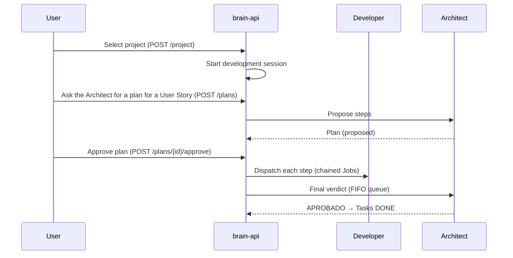

# Concepts

Factory Brain's domain model. Terminology used throughout the documentation, the API and the interfaces.

## Project

A Git repository of the workspace. It is the **main unit of work**: Factory Brain never operates on arbitrary directories. The active project is chosen at startup and persisted to disk.

- Discovery: `os.walk` of the workspace looking for `.git` directories (5s cache TTL).
- `Project`: `{id (path), name, path, repository, workspace_id}`.

## Workspace

The root where repositories are discovered (e.g. `factoria-software/`). A workspace contains multiple projects.

## Development session

A live working environment over a project. States: `created` → `active` → `closed`. When you choose a project its session starts; when you change project, not-stopped agents are stopped and the previous one is closed.

The session keeps: the active project, launched agents, the Job history and context. **It lives in the memory of the `brain-api` process** (not persisted to disk).

## Agent

An instance of a **role** running on a **runtime** in a tmux session. It is not a language model nor a generic process: it is role + prompt + runtime + state.

- Roles: `developer`, `arquitecto`, plus `auditor_oss`/`ux`/`tester` (declared in the role registry, not yet backend-registered — see [Agents](agents.md)).
- States: `idle` → `working` / `unavailable` / `stopped`; `unavailable → idle`; `stopped` is terminal (must relaunch) — except Developer, which never reaches `stopped`: stopping it deletes the instance outright instead of pausing it.
- Reuse: when launching the reusable Architect role, the existing live agent is reused instead of duplicating. Developer always creates a new instance on launch (up to a configurable simultaneous limit), never reused.

## Runtime

An external AI executable launched in tmux: **Claude Code** or **OpenCode**. The concrete model is passed at launch (only OpenCode supports model selection). See [Runtime and Scribe](runtime.md).

## Job

A unit of work sent to an agent: a text description. States: `created → running → {completed | failed | cancelled}`.

- `POST /jobs` is **blocking**: the response arrives when the Job finishes.
- The result is reported cooperatively (the agent writes its output to a file with a final marker).
- **Chaining**: you can pass `previous_job_id`; the previous Job's result is injected literally into the new Job's description. Developer→Developer is blocked.
- Full session history via `GET /jobs`.

## Plan (of the Architect)

A sequence of steps to complete a User Story, proposed by the Architect. States: `proposed → {approved, rejected}`, `approved → {blocked, cancelled}`.

- Each step has a `mechanism`: `agent` (a role runs it), `scribe` (Scribe does it), or `script` (degraded: no-op).
- After the **single human approval**, the plan is dispatched end to end; the Architect issues a verdict at the end and marks the Tasks `DONE` if approved.

## Scribe

A local deterministic tool (not a conversational agent) that summarizes/indexes documentation with a local model via Ollama. Operations: `summarize_document`, `index_documents`, `resumir_estado_backlog`, `index_scripts`. Used by the Dispatcher to save tokens. See [Runtime and Scribe](runtime.md).

## Script

- **Generic** (bundled with Factory Brain, 7): `commit`, `push`, `changed_files`, `diff_stat`, `language_stats`, `backlog_status`, `run_tests`.
- **Project-specific** (of the project, `.factory-brain/scripts.yml`): e.g. `deploy-web`.

## Backlog

The set of Epics, User Stories and Tasks of the active project (`02-backlog/`), with state, dependencies, priority and phase. It is the **central control panel** of the product: work is deployed from here. See [Backlog and pipeline](backlog.md).

## Typical workflow

## Quick glossary

| Term | Meaning |
|---|---|
| **Project** | Git repository, unit of work |
| **Session** | Live environment over a project |
| **Agent** | Role + runtime + prompt in tmux |
| **Runtime** | Claude Code / OpenCode |
| **Job** | Text task to an agent |
| **Plan** | Sequence of steps from the Architect |
| **Scribe** | Local summarization/indexing via Ollama |
| **Developer** | Implements User Stories |
| **Architect** | Lands the backlog (Epic→US→Task), reviews/validates Developer work and issues verdicts, and converses about existing Epics (read-only) |
