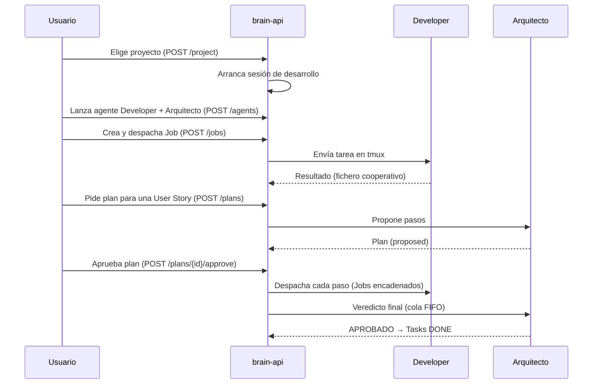

# Conceptos

Modelo de dominio de Factory Brain. Terminología usada en toda la documentación, la API y las interfaces.

## Proyecto

Un repositorio Git del workspace. Es la **unidad principal de trabajo**: Factory Brain nunca opera sobre directorios arbitrarios. El proyecto activo se elige en el arranque y se persiste a disco.

- Descubrimiento: `os.walk` del workspace buscando directorios `.git` (5s TTL de caché).
- `Project`: `{id (path), name, path, repository, workspace_id}`.

## Workspace

La raíz donde se descubren los repositorios (p. ej. `factoria-software/`). Un workspace contiene múltiples proyectos.

## Sesión de desarrollo

Entorno de trabajo vivo sobre un proyecto. Estados: `created` → `active` → `closed`. Al elegir proyecto se arranca su sesión; al cambiar de proyecto se detienen los agentes no detenidos y se cierra la anterior.

La sesión mantiene: proyecto activo, agentes lanzados, historial de Jobs, contexto. **Vive en memoria del proceso `brain-api`** (no se persiste a disco).

## Agente

Una instancia de un **rol** ejecutándose sobre un **runtime** en una sesión tmux. No es un modelo de lenguaje ni un proceso genérico: es rol + prompt + runtime + estado.

- Roles: `developer`, `critic`, `director`, `arquitecto` (ver [Agentes](agents.md)).
- Estados: `idle` → `working` / `unavailable` / `stopped`; `unavailable → idle`; `stopped` es terminal (hay que relanzar).
- Reutilización: al lanzar un rol reutilizable (Critic/Director/Arquitecto), se reutiliza el agente vivo existente en vez de duplicar.

## Runtime

Un ejecutable de IA externo lanzado en tmux: **Claude Code** o **OpenCode**. El modelo concreto se pasa en el arranque (solo OpenCode soporta selección de modelo). Ver [Runtime y Scribe](runtime.md).

## Job

Unidad de trabajo enviada a un agente: una descripción de texto. Estados: `created → running → {completed | failed | cancelled}`.

- `POST /jobs` es **bloqueante**: la respuesta llega cuando el Job termina.
- El resultado se reporta de forma cooperativa (el agente escribe su salida a un fichero con una marca final).
- **Encadenado**: se puede pasar `previous_job_id`; el resultado del Job anterior se inyecta literalmente en la descripción del nuevo. Developer→Developer bloqueado.
- Histórico completo de la sesión vía `GET /jobs`.

## Plan (del Arquitecto)

Secuencia de pasos para completar una User Story, propuesta por el Arquitecto. Estados: `proposed → {approved, rejected}`, `approved → {blocked, cancelled}`.

- Cada paso tiene `mechanism`: `agent` (lo ejecuta un rol), `scribe` (lo hace Scribe), o `script` (degradado: no-op).
- Tras la **única aprobación humana**, el plan se despacha de extremo a extremo; el Arquitecto emite un veredicto al final y marca las Tasks `DONE` si se aprueba.

## Scribe

Herramienta determinista local (no un agente conversacional) que resume/indexa documentación con un modelo local vía Ollama. Operaciones: `summarize_document`, `index_documents`, `resumir_estado_backlog`, `index_scripts`. Usada por el Dispatcher para ahorrar tokens. Ver [Runtime y Scribe](runtime.md).

## Script

- **Genéricos** (traídos por Factory Brain, 7): `commit`, `push`, `changed_files`, `diff_stat`, `language_stats`, `backlog_status`, `run_tests`.
- **Particulares** (del proyecto, `.factory-brain/scripts.yml`): p. ej. `deploy-web`.

## Backlog

Conjunto de Epics, User Stories y Tasks del proyecto activo (`02-backlog/`), con estado, dependencias, prioridad y fase. Ver [Backlog y pipeline](backlog.md).

## Flujo típico de trabajo

## Glosario rápido

| Término | Significado |
|---|---|
| **Proyecto** | Repositorio Git, unidad de trabajo |
| **Sesión** | Entorno vivo sobre un proyecto |
| **Agente** | Rol + runtime + prompt en tmux |
| **Runtime** | Claude Code / OpenCode |
| **Job** | Tarea de texto a un agente |
| **Plan** | Secuencia de pasos del Arquitecto |
| **Scribe** | Resumen/indexación local vía Ollama |
| **Developer** | Implementa User Stories |
| **Critic / Arquitecto** | Revisa/valida trabajo, propone planes y emite veredictos |
| **Director** | Conversa sobre Epics existentes (no modifica backlog) |
