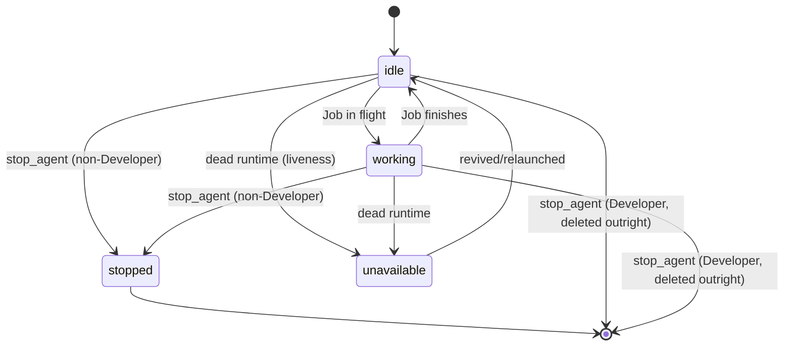

# Agents

Agents are the fundamental unit of work. An agent = **role** + **prompt** + **runtime** + **tmux session** + **state**. They are not language models nor generic processes.

In the backlog-centric pipeline, agents are roles orchestrated by the product (Architect, Developer, Tester) rather than launched one by one by hand: the product decides who runs each step of the work pipeline.

## Registered roles

Atlas Forge uses a **centralized role registry** (`atlas_forge/agents/roles.py`) where each role declares: base prompt, governance file, prompt builder and registration function. Roles are registered at import-time when importing `atlas_forge.agents`.

| Role | Governance | Behavior |
|---|---|---|
| **`developer`** | `developer.md` | Implements User Stories. Persistent and human-managed (not ephemeral — keeps conversation context across successive Jobs). Always creates a new instance when launched (never reused), self-named `Developer-1`, `Developer-2`… up to a configurable simultaneous limit (default **3**, `GET`/`PUT /system/preferences`). "Stop" deletes the instance outright and frees its slot immediately — there is no paused/reusable Developer to relaunch. |
| **`arquitecto`** | `ARQUITECTO.md` | Reusable, **triple-function** role: lands the backlog (generates Epic→US→Task in standard format), issues structured **verdicts** (`APROBADO` / `APROBADO_CON_OBSERVACIONES` / `RECHAZADO`) on Developer work, and converses with the human about existing Epics (read-only on the backlog). |
| **`tester`** | `TESTER.md` | Verifies a closed Task's work (`dispatcher/tester_input.py` packages acceptance criteria + code diff for a Tester Job) and returns a structured verdict (`EXITO` / `FALLO`). A failed Task goes back to the same Developer for corrections. Reusable, single instance per session. |
| **`ux`** | `UX.md` | Headless web UX audits (run via `opencode run --auto`). Reusable. |
| **`auditor_oss`** | `AUDITOR-OSS.md` | OSS audit of the web UX. Reusable. |
| **`documentador`** | `DOCUMENTADOR.md` | Keeps the public documentation (`docs/`) aligned with the real code (Senior Developer Advocate). Reusable. |

## Prompts: two layers (base role + project governance)

The initial prompt of an agent is built in two layers, both decided by Atlas Forge (never by the agent):

1. **Base role** (code): responsibility and limits + generic reporting protocol.
2. **Project-specific governance**: if the active project declares `00-gobierno/<role>.md` + `00-gobierno/METODOLOGIA.md`, an explicit instruction is added telling the agent to read them. A project without that convention does not degrade behavior (it just lacks the extra layer).

## Launching

`launch_agent(role, runtime_type, model, session, project_path, socket_name)` validates in order: active session → known role → known runtime (`claude-code` | `opencode` | `codex`) → model only allowed for OpenCode. If the role is reusable and there is already a live agent (`idle`/`working`) of that role, it is **reused** instead of duplicated; if it is `stopped`/`unavailable`, it is replaced with a new one.

With `initial_job_description`, besides launching, an initial blocking Job is created and dispatched (`launch_agent_with_initial_job`); a dispatch failure leaves the Job `failed` with the reason in `job.result` but does **not** un-register the agent.

## Lifecycle

- `stopped` = intentional human stop (terminal; must relaunch). Applies to Architect and any other single-instance reusable role.
- **Developer never reaches `stopped`**: `stop_agent` deletes it from the session outright, freeing its slot in the simultaneous-Developer limit immediately. This is a deliberate exception — see `stop_agent`/`agents/stop.py` docstring for the reasoning.
- `unavailable` = unsolicited failure (dead runtime).
- On finishing a Job (success or failure), an agent **always** returns to `idle` — it is never left stuck `working`, and is not destroyed automatically. It stays alive, reusable for the next Job regardless of which Epic/User Story it came from, until the human stops/deletes it explicitly.
- **Liveness is checked lazily** when querying `GET /agents` (`refresh_agent_liveness`): if the runtime is dead and the state was `idle`/`working`, it transitions to `unavailable`. No background polling.

## Reuse

`register_agent_with_reuse` looks for an existing agent of the same role in the session. Reuse applies to Architect (persistent, reused across conversation and verdict Jobs); the Developer always creates a new instance when launched (up to the configured simultaneous limit, default 3, `GET`/`PUT /system/preferences`) — never reused on launch. Reason: `_find_agent_by_role` picks the first agent of a role — substitution (not coexistence) avoids a stopped agent of a role blocking routing.

## Runtime↔agent registry

`agent_runtime_registry` maps `agent_id → RuntimeInstance` (process-scoped). Launching registers it; `stop_agent` and liveness consult it. `stop_agent` first kills the tmux session, then either transitions to `stopped` (non-Developer roles) or removes the agent from the session entirely (Developer) — never to `unavailable` in either case, that state is reserved for unsolicited failures.

## Reading the active model

- **OpenCode**: `GET /agents/{id}/model` reads the model **passively** from the runtime's status bar (`capture_pane_lines`) — safe to call on every `GET /agents`/poll, never interacts with the pane.
- **Claude Code**: there is no passive source (its status bar does not print the model). `GET /agents/{id}/status-model` reads it **on demand** by sending `/status` to the pane, capturing the resulting panel, and closing it with `Escape` — this is active interaction, so it is **never** triggered automatically, and returns 400 if the agent is `working` (to avoid interfering with output in progress).

## Launch options catalog

`GET /agents/options` (and `list_available_agent_options` in the domain) generates the **roles × enabled models** Cartesian product, with the runtime resolved automatically from the model catalog. `supports_model` indicates whether that model supports hot model switching (OpenCode only).

## Governance

`project_has_governance(project, role)` checks on disk that `00-gobierno/<role>.md` and `00-gobierno/METODOLOGIA.md` exist. `project_governance_instruction(...)` returns the instruction to add to the prompt (or empty string). See the project's `00-gobierno/` for the real files: `ARQUITECTO.md`, `AUDITOR-OSS.md`, `DEVELOPER.md`, `DOCUMENTADOR.md`, `METODOLOGIA.md`, `OPERACION.md`, `TESTER.md`, `UX.md` (retired roles live in `00-gobierno/old/`).

## Planned (not implemented)

- **Stuck-agent detection and automatic recovery** (AF-023): a human-triggered "review if stuck" action exists in the web (dispatches a real Job asking the Architect to judge the agent's pane) — automatic background detection is not implemented.
- **Agent capability declaration** (US-AF005-03): blocked until the Capability Engine (AF-010).
