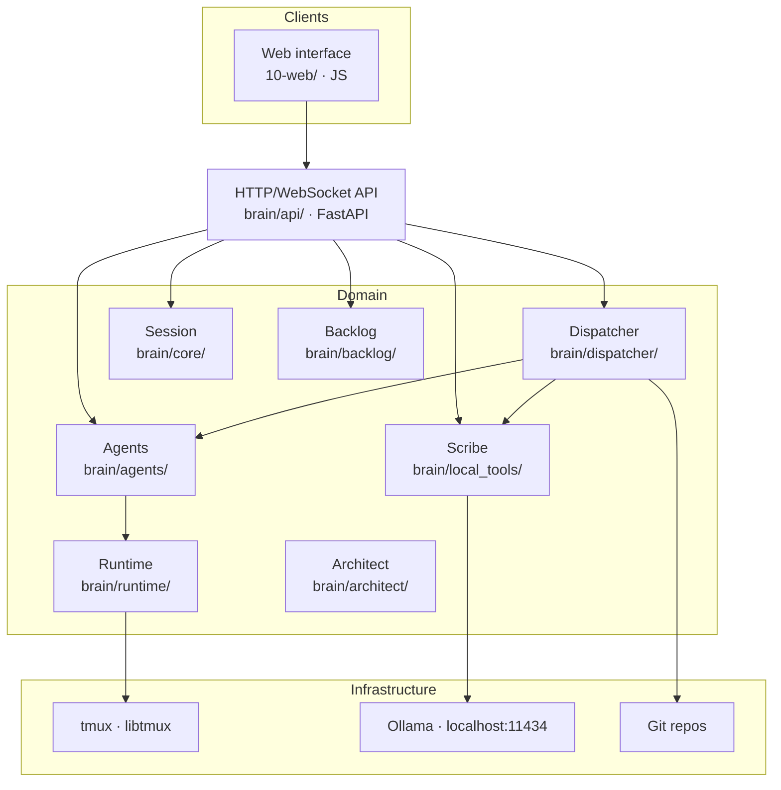

# Architecture

Factory Brain is a **modular, extensible and maintainable** application, designed to add new capabilities without restructuring the project.

## Core idea

The domain (projects, sessions, agents, Jobs, backlog) lives **behind a single HTTP/WebSocket API** (`brain/api/`, FastAPI). No client accesses the domain any other way than through that API.

> One process of truth (`brain-api`), one client: the **web interface**.

## Layers



### Presentation

Web interface (plain JS served by the backend itself at `/ui/`). **No business logic**: all interaction goes through the API.

### Application

The API (`brain/api/routes.py`) orchestrates operations: it launches agents, creates/dispatches Jobs, runs scripts and exposes the backlog state. It is a thin layer over the domain — it does not reimplement logic, it exposes it.

### Domain

Interface-independent business rules:

- **`brain/core/`** — development session lifecycle.
- **`brain/agents/`** — role registry, launching, lifecycle, liveness, stop, governance.
- **`brain/runtime/`** — runtime instances in tmux (Claude Code, OpenCode, Codex).
- **`brain/dispatcher/`** — Job creation, dispatch, reporting, cancellation; the background Dispatcher that drives the state-based backlog pipeline (implementation, Task review, Story verdict, US→Tasks landing); automatic Scribe triggering.
- **`brain/backlog/`** — backlog parser, status report, detail, validator, dependency graph.
- **`brain/architect/`** — Epic→US→Task generators, gap review, self-auditing pipelines.
- **`brain/local_tools/`** — Scribe (local summarization/indexing via Ollama).
- **`brain/workspace/`** — project discovery, active project, generic and project scripts, startup.
- **`brain/models/`** — domain dataclasses (Agent, Job, DevelopmentSession, Project, backlog, scripts).

### Infrastructure

- **tmux** (`factory-brain` socket) for persistent runtime sessions.
- **Git** to discover repositories and run scripts.
- **Ollama** for Scribe.
- **systemd** for the `brain-api` service.

## Persistence

| Data | Where | Persistent |
|---|---|---|
| Active project | `~/.local/share/brain/active_project.json` | Yes |
| Model preferences | `~/.local/share/brain/model_preferences.json` | Yes |
| Session, agents, Jobs | In the memory of `brain-api` | No |
| Closing reports | `07-informes/<US>/<job_id>.md` | Yes (files) |
| Backlog | `02-backlog/` of the active project | Yes (Markdown files) |

## Module detail

### Development session (`brain/core/`)

A session is a persistent working environment over a project. States: `created` → `active` → `closed`. It is created when you select a project and closed when you change project (stopping any not-stopped agents first).

### Runtimes (`brain/runtime/`)

Each launched agent is a **runtime instance** in its own tmux session (`runtime/agent_model.py`):
- **Claude Code**: `claude --dangerously-skip-permissions [--model <model>]` + prompt as positional argument.
- **OpenCode**: `opencode --auto [--model provider/model]` + `--prompt "..."`.
- **Codex**: `codex -a never -s workspace-write [--model <model>]` + prompt as positional argument.

The `agent_runtime_registry` maps `agent_id → RuntimeInstance`. Liveness is checked lazily when queried (no polling).

### Agents (`brain/agents/`)

Registered roles: `developer`, `arquitecto`, `tester`, `documentador`, `ux`, `auditor_oss`. Each role defines a base prompt + governance file + registration function. See [Agents](agents.md).

### Dispatcher (`brain/dispatcher/`)

- **Job**: `create → running → {completed | failed | cancelled}`. Result reporting is **cooperative**: the agent writes its result to a temp file plus a final marker; the dispatcher waits for that file.
- **Chaining**: `previous_job` injects the previous Job's result literally into the next Job's description. Developer→Developer is blocked (must go through the Architect).
- **Backlog pipeline**: a single background worker polls every 5 seconds and drives each item forward purely by its `state` — queues Tasks `READY` as `TO_DEVELOP`, assigns a Task `TO_DEVELOP` to a Developer (`IN_PROGRESS`), hands a Task in `IN_REVIEW` to a free Tester, a User Story with all its Tasks `DONE` to a free Architect for final validation, and a US `TO_PLAN` to a free Architect for its US→Tasks landing. See [Jobs and the work pipeline](jobs.md#the-backlog-pipeline).
- **Automatic Scribe**: the dispatcher decides to invoke Scribe (by description size > 4000 chars or ≥ 10 consecutive Jobs) to pre-process context, saving remote runtime tokens.
- **Verdict**: on a User Story in `IN_REVIEW` (all its Tasks `DONE`), the assigned Architect emits `APROBADO` / `APROBADO_CON_OBSERVACIONES` / `RECHAZADO`; approved moves the Story to `DONE`, rejected adds a new Task to the same Story instead of promoting it.

### Backlog (`brain/backlog/`)

Deterministic parser of `02-backlog/` (Epics, User Stories, Tasks) → a graph of items with state, dependencies, priority and phase. Status report (`build_backlog_report`) with counts per Epic, LISTA/BLOQUEADA items, max-leverage chain and unblock degree. Schema validator for the backlog format.

### API (`brain/api/`)

FastAPI with REST endpoints + WebSocket `/ws/jobs`, static `/ui/` and `/health`. See [API](api.md).

## Directory structure

```text
PROD-006-factory-brain/
├── 00-gobierno/       # project governance (METODOLOGIA, roles)
├── 02-backlog/        # canonical backlog: epics/, user-stories/, tasks/, roadmap.md
├── 04-src/            # source code (brain package) and tests
├── 07-informes/       # closing Job reports and analyses
├── 10-web/            # web interface (served by brain-api at /ui/)
└── deploy/            # systemd units
```

## Module isolation

The project verifies by test (`04-src/tests/test_module_boundaries.py`) that clients do not access the domain directly except for bounded, documented exceptions (static agent catalog, local disk configuration). An interface without a local process (web) depends entirely on the API.
