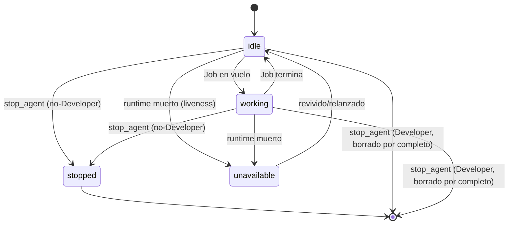

# Agentes

Los agentes son la unidad fundamental de trabajo. Un agente = **rol** + **prompt** + **runtime** + **sesión de tmux** + **estado**. No son modelos de lenguaje ni procesos genéricos.

En el pipeline centrado en el backlog, los agentes son roles orquestados por el producto (Arquitecto, Developer, Tester) en lugar de lanzarse uno a uno a mano: el producto decide quién ejecuta cada paso del pipeline de trabajo.

## Roles registrados

Atlas Forge usa un **registro de roles centralizado** (`atlas_forge/agents/roles.py`) donde cada rol declara: prompt base, archivo de gobernanza, constructor de prompt y función de registro. Los roles se registran en tiempo de importación al importar `atlas_forge.agents`.

| Rol | Gobernanza | Comportamiento |
|---|---|---|
| **`developer`** | `developer.md` | Implementa User Stories. Persistente y gestionado por humanos (no efímero — mantiene el contexto de conversación entre Jobs sucesivos). Siempre crea una instancia nueva al lanzarse (nunca se reutiliza), auto-nombrado `Developer-1`, `Developer-2`… hasta un límite simultáneo configurable (por defecto **3**, `GET`/`PUT /system/preferences`). "Stop" borra la instancia por completo y libera su slot inmediatamente — no hay Developer pausado/reutilizable que relanzar. |
| **`arquitecto`** | `ARQUITECTO.md` | Rol reutilizable de **triple función**: aterriza el backlog (genera Epic→US→Task en formato estándar), emite **veredictos** estructurados (`APROBADO` / `APROBADO_CON_OBSERVACIONES` / `RECHAZADO`) sobre el trabajo del Developer, y conversa con el humano sobre Epics existentes (solo lectura del backlog). |
| **`tester`** | `TESTER.md` | Verifica el trabajo de una Task cerrada (`dispatcher/tester_input.py` empaqueta criterios de aceptación + diff de código para un Job de Tester) y devuelve un veredicto estructurado (`EXITO` / `FALLO`). Una Task fallida vuelve al mismo Developer para correcciones. Reutilizable, instancia única por sesión. |
| **`ux`** | `UX.md` | Auditorías de UX web headless (ejecutadas vía `opencode run --auto`). Reutilizable. |
| **`auditor_oss`** | `AUDITOR-OSS.md` | Auditoría OSS de la UX web. Reutilizable. |
| **`documentador`** | `DOCUMENTADOR.md` | Mantiene la documentación pública (`docs/`) alineada con el código real (Senior Developer Advocate). Reutilizable. |

## Prompts: dos capas (rol base + gobernanza de proyecto)

El prompt inicial de un agente se construye en dos capas, ambas decididas por Atlas Forge (nunca por el agente):

1. **Rol base** (código): responsabilidad y límites + protocolo de reporte genérico.
2. **Gobernanza específica del proyecto**: si el proyecto activo declara `00-gobierno/<role>.md` + `00-gobierno/METODOLOGIA.md`, se añade una instrucción explícita que dice al agente que las lea. Un proyecto sin esa convención no degrada el comportamiento (solo carece de la capa extra).

## Lanzamiento

`launch_agent(role, runtime_type, model, session, project_path, socket_name)` valida en orden: sesión activa → rol conocido → runtime conocido (`claude-code` | `opencode`) → modelo solo permitido para OpenCode. Si el rol es reutilizable y ya hay un agente vivo (`idle`/`working`) de ese rol, se **reutiliza** en lugar de duplicarse; si está `stopped`/`unavailable`, se sustituye por uno nuevo.

Con `initial_job_description`, además de lanzar, se crea y despacha un Job bloqueante inicial (`launch_agent_with_initial_job`); un fallo de despacho deja el Job `failed` con el motivo en `job.result` pero **no** des-registra el agente.

## Ciclo de vida

- `stopped` = parada humana intencional (terminal; hay que relanzar). Aplica al Arquitecto y a cualquier otro rol reutilizable de instancia única.
- **El Developer nunca llega a `stopped`**: `stop_agent` lo borra de la sesión por completo, liberando su slot en el límite de Developers simultáneos inmediatamente. Es una excepción deliberada — ver el docstring de `stop_agent`/`agents/stop.py` para el razonamiento.
- `unavailable` = fallo no solicitado (runtime muerto).
- Al terminar un Job (éxito o fallo), un agente **siempre** vuelve a `idle` — nunca queda atascado en `working`, y no se destruye automáticamente. Permanece vivo, reutilizable para el siguiente Job sin importar de qué Epic/User Story vino, hasta que el humano lo detenga/borre explícitamente.
- **El liveness se comprueba de forma perezosa** al consultar `GET /agents` (`refresh_agent_liveness`): si el runtime está muerto y el estado era `idle`/`working`, transiciona a `unavailable`. Sin polling en segundo plano.

## Reuso

`register_agent_with_reuse` busca un agente existente del mismo rol en la sesión. El reuso aplica al Arquitecto (persistente, reutilizado entre conversaciones y Jobs de veredicto); el Developer siempre crea una instancia nueva al lanzarse (hasta el límite simultáneo configurado, por defecto 3, `GET`/`PUT /system/preferences`) — nunca se reutiliza al lanzar. Motivo: `_find_agent_by_role` elige al primer agente de un rol — la sustitución (no la coexistencia) evita que un agente detenido de un rol bloquee el enrutado.

## Registro runtime↔agente

`agent_runtime_registry` mapea `agent_id → RuntimeInstance` (ámbito de proceso). El lanzamiento lo registra; `stop_agent` y el liveness lo consultan. `stop_agent` primero mata la sesión de tmux, luego transiciona a `stopped` (roles no-Developer) o elimina el agente de la sesión por completo (Developer) — nunca a `unavailable` en ninguno de los dos casos, ese estado está reservado para fallos no solicitados.

## Lectura del modelo activo

- **OpenCode**: `GET /agents/{id}/model` lee el modelo **pasivamente** de la barra de estado del runtime (`capture_pane_lines`) — segura de llamar en cada `GET /agents`/poll, nunca interactúa con el pane.
- **Claude Code**: no hay fuente pasiva (su barra de estado no imprime el modelo). `GET /agents/{id}/status-model` lo lee **bajo demanda** enviando `/status` al pane, capturando el panel resultante y cerrándolo con `Escape` — esto es interacción activa, por lo que **nunca** se dispara automáticamente, y devuelve 400 si el agente está `working` (para no interferir con la salida en curso).

## Catálogo de opciones de lanzamiento

`GET /agents/options` (y `list_available_agent_options` en el dominio) genera el producto cartesiano **roles × modelos habilitados**, con el runtime resuelto automáticamente desde el catálogo de modelos. `supports_model` indica si ese modelo soporta cambio de modelo en caliente (solo OpenCode).

## Gobernanza

`project_has_governance(project, role)` comprueba en disco que `00-gobierno/<role>.md` y `00-gobierno/METODOLOGIA.md` existen. `project_governance_instruction(...)` devuelve la instrucción a añadir al prompt (o cadena vacía). Ver el `00-gobierno/` del proyecto para los archivos reales: `ARQUITECTO.md`, `AUDITOR-OSS.md`, `DEVELOPER.md`, `DOCUMENTADOR.md`, `METODOLOGIA.md`, `OPERACION.md`, `TESTER.md`, `UX.md` (los roles retirados viven en `00-gobierno/old/`).

## Planificado (no implementado)

- **Detección de agentes atascados y recuperación automática** (AF-023): existe una acción disparada por humanos de "revisar si está atascado" en la web (despacha un Job real pidiendo al Arquitecto que juzgue el pane del agente) — la detección automática en segundo plano no está implementada.
- **Declaración de capacidades de agente** (US-AF005-03): bloqueada hasta el Capability Engine (AF-010).