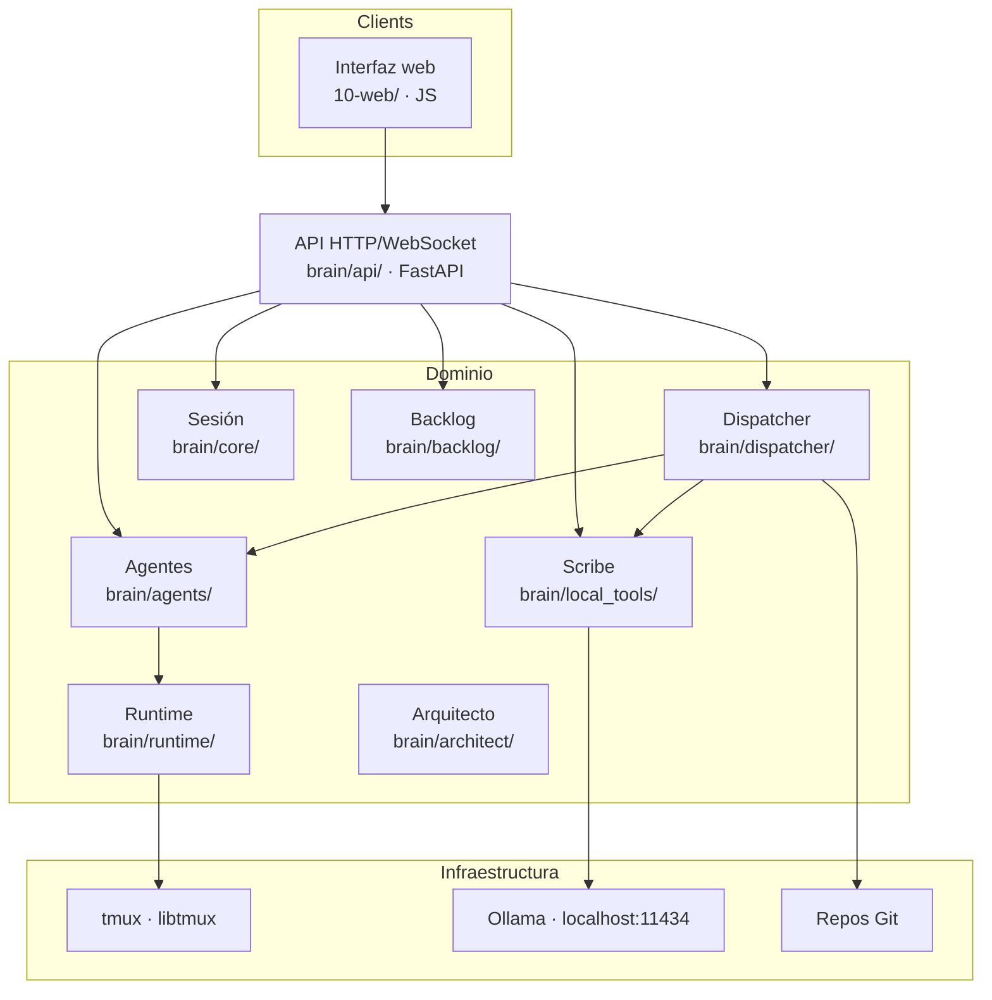

# Arquitectura

Factory Brain es una aplicación **modular, extensible y mantenible**, diseñada para añadir nuevas capacidades sin reestructurar el proyecto.

## Idea central

El dominio (proyectos, sesiones, agentes, Jobs, backlog) vive **detrás de una única API HTTP/WebSocket** (`brain/api/`, FastAPI). Ningún cliente accede al dominio de otra forma que no sea a través de esa API.

> Un proceso de verdad (`brain-api`), un cliente: la **interfaz web**.

## Capas



### Presentación

Interfaz web (JS puro servido por el propio backend en `/ui/`). **Sin lógica de negocio**: toda la interacción pasa por la API.

### Aplicación

La API (`brain/api/routes.py`) orquesta las operaciones: lanza agentes, crea/despacha Jobs, ejecuta scripts y expone el estado del backlog. Es una capa fina sobre el dominio — no reimplementa lógica, la expone.

### Dominio

Reglas de negocio independientes de la interfaz:

- **`brain/core/`** — ciclo de vida de la sesión de desarrollo.
- **`brain/agents/`** — registro de roles, lanzamiento, ciclo de vida, liveness, stop, gobernanza.
- **`brain/runtime/`** — instancias de runtime en tmux (Claude Code, OpenCode, Codex).
- **`brain/dispatcher/`** — creación, despacho, reporte y cancelación de Jobs; el Dispatcher en segundo plano que impulsa el pipeline de backlog guiado por estados (implementación, revisión de Tasks, veredicto de Story, aterrizaje US→Tasks); disparo automático de Scribe.
- **`brain/backlog/`** — parser de backlog, informe de estado, detalle, validador, grafo de dependencias.
- **`brain/architect/`** — generadores Epic→US→Task, revisión de brechas, pipelines de auto-auditoría.
- **`brain/local_tools/`** — Scribe (resumen/indexación local vía Ollama).
- **`brain/workspace/`** — descubrimiento de proyectos, proyecto activo, scripts genéricos y de proyecto, arranque.
- **`brain/models/`** — dataclasses de dominio (Agent, Job, DevelopmentSession, Project, backlog, scripts).

### Infraestructura

- **tmux** (socket `factory-brain`) para sesiones de runtime persistentes.
- **Git** para descubrir repositorios y ejecutar scripts.
- **Ollama** para Scribe.
- **systemd** para el servicio `brain-api`.

## Persistencia

| Dato | Dónde | Persistente |
|---|---|---|
| Proyecto activo | `~/.local/share/brain/active_project.json` | Sí |
| Preferencias de modelo | `~/.local/share/brain/model_preferences.json` | Sí |
| Sesión, agentes, Jobs | En la memoria de `brain-api` | No |
| Informes de cierre | `07-informes/<US>/<job_id>.md` | Sí (ficheros) |
| Backlog | `02-backlog/` del proyecto activo | Sí (archivos Markdown) |

## Detalle de módulos

### Sesión de desarrollo (`brain/core/`)

Una sesión es un entorno de trabajo persistente sobre un proyecto. Estados: `created` → `active` → `closed`. Se crea al seleccionar un proyecto y se cierra al cambiar de proyecto (deteniendo antes los agentes no detenidos).

### Runtimes (`brain/runtime/`)

Cada agente lanzado es una **instancia de runtime** en su propia sesión de tmux (`runtime/agent_model.py`):
- **Claude Code**: `claude --dangerously-skip-permissions [--model <model>]` + prompt como argumento posicional.
- **OpenCode**: `opencode --auto [--model provider/model]` + `--prompt "..."`.
- **Codex**: `codex -a never -s workspace-write [--model <model>]` + prompt como argumento posicional.

El `agent_runtime_registry` mapea `agent_id → RuntimeInstance`. El liveness se comprueba de forma perezosa al consultarlo (sin polling).

### Agentes (`brain/agents/`)

Roles registrados: `developer`, `arquitecto`, `tester`, `documentador`, `ux`, `auditor_oss`. Cada rol define un prompt base + archivo de gobernanza + función de registro. Ver [Agentes](agents.md).

### Dispatcher (`brain/dispatcher/`)

- **Job**: `create → running → {completed | failed | cancelled}`. El reporte de resultados es **cooperativo**: el agente escribe su resultado en un fichero temporal más un marcador final; el dispatcher espera ese fichero.
- **Encadenamiento**: `previous_job` inyecta literalmente el resultado del Job anterior en la descripción del Job siguiente. Developer→Developer está bloqueado (debe pasar por el Arquitecto).
- **Pipeline de backlog**: un único worker en segundo plano sondea cada 5 segundos e impulsa cada ítem puramente por su `state` — asigna una Task elegible a un Developer, entrega una Task cerrada a un Tester libre, una User Story completamente `DONE` a un Arquitecto libre para su veredicto, y una User Story `EN_DISEÑO` a un Arquitecto libre para su aterrizaje US→Tasks. Ver [Jobs y el pipeline de trabajo](jobs.md#el-pipeline-de-backlog).
- **Scribe automático**: el dispatcher decide invocar Scribe (por tamaño de descripción > 4000 caracteres o ≥ 10 Jobs consecutivos) para pre-procesar contexto, ahorrando tokens de runtimes remotos.
- **Veredicto**: en una User Story en `REVIEW`, el Arquitecto asignado emite `APROBADO` / `APROBADO_CON_OBSERVACIONES` / `RECHAZADO`; aprobada mueve la Story a `DONE`, rechazada añade una nueva Task a la misma Story en lugar de promoverla.

### Backlog (`brain/backlog/`)

Parser determinista de `02-backlog/` (Epics, User Stories, Tasks) → un grafo de ítems con estado, dependencias, prioridad y fase. Informe de estado (`build_backlog_report`) con conteos por Epic, ítems LISTA/BLOQUEADA, cadena de máximo apalancamiento y grado de desbloqueo. Validador de esquema para el formato de backlog.

### API (`brain/api/`)

FastAPI con endpoints REST + WebSocket `/ws/jobs`, `/ui/` estático y `/health`. Ver [API](api.md).

## Estructura de directorios

```text
PROD-006-factory-brain/
├── 00-gobierno/       # gobernanza del proyecto (METODOLOGIA, roles)
├── 02-backlog/        # backlog canónico: epics/, user-stories/, tasks/, roadmap.md
├── 04-src/            # código fuente (paquete brain) y tests
├── 07-informes/       # informes de cierre de Jobs y análisis
├── 10-web/            # interfaz web (servida por brain-api en /ui/)
└── deploy/            # unidades systemd
```

## Aislamiento de módulos

El proyecto verifica por test (`04-src/tests/test_module_boundaries.py`) que los clientes no acceden al dominio directamente salvo excepciones acotadas y documentadas (catálogo estático de agentes, configuración de disco local). Una interfaz sin proceso local (web) depende completamente de la API.