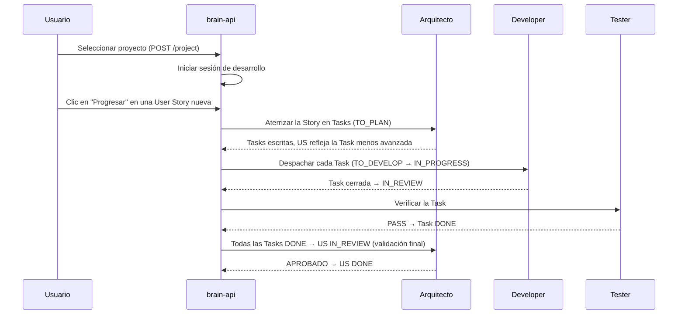

# Conceptos

El modelo de dominio de Factory Brain. Terminología usada en toda la documentación, la API y las interfaces.

## Proyecto

Un repositorio Git del workspace. Es la **unidad principal de trabajo**: Factory Brain nunca opera sobre directorios arbitrarios. El proyecto activo se elige al arrancar y se persiste en disco.

- Descubrimiento: `os.walk` del workspace buscando directorios `.git` (TTL de caché 5s).
- `Project`: `{id (path), name, path, repository, workspace_id}`.

## Workspace

La raíz donde se descubren los repositorios (p. ej. `factoria-software/`). Un workspace contiene varios proyectos.

## Sesión de desarrollo

Un entorno de trabajo vivo sobre un proyecto. Estados: `created` → `active` → `closed`. Cuando eliges un proyecto, su sesión arranca; cuando cambias de proyecto, se detienen los agentes no detenidos y se cierra el anterior.

La sesión mantiene: el proyecto activo, los agentes lanzados, el historial de Jobs y el contexto. **Vive en la memoria del proceso `brain-api`** (no persistido en disco).

## Agente

Una instancia de un **rol** ejecutándose sobre un **runtime** en una sesión de tmux. No es un modelo de lenguaje ni un proceso genérico: es rol + prompt + runtime + estado.

- Roles: `developer`, `arquitecto`, `tester`, más `auditor_oss`/`ux` (declarados en el registro de roles — ver [Agentes](agents.md)).
- Estados: `idle` → `working` / `unavailable` / `stopped`; `unavailable → idle`; `stopped` es terminal (hay que relanzar) — excepto Developer, que nunca llega a `stopped`: detenerlo borra la instancia por completo en lugar de pausarla.
- Reuso: al lanzar un rol reutilizable (Arquitecto, Tester), el agente vivo existente se reutiliza en lugar de duplicarse. Developer siempre crea una instancia nueva al lanzarse (hasta un límite simultáneo configurable), nunca se reutiliza.

## Runtime

Un ejecutable de IA externo lanzado en tmux: **Claude Code**, **OpenCode** o **Codex**. Runtime y modelo se eligen explícitamente en el momento del lanzamiento — sin cambio en caliente para un agente vivo. Ver [Runtime y Scribe](runtime.md).

## Job

Una unidad de trabajo enviada a un agente: una descripción de texto. Estados: `created → running → {completed | failed | cancelled}`.

- `POST /jobs` es **bloqueante**: la respuesta llega cuando el Job termina.
- El resultado se reporta cooperativamente (el agente escribe su salida en un fichero con un marcador final).
- **Encadenamiento**: puedes pasar `previous_job_id`; el resultado del Job anterior se inyecta literalmente en la descripción del nuevo Job. Developer→Developer está bloqueado.
- Historial completo de sesión vía `GET /jobs`.

## El Dispatcher

Un único proceso en segundo plano que sondea cada 5 segundos y mueve el trabajo hacia adelante, guiado por el `state` de cada ítem: encola Tasks `READY` como `TO_DEVELOP`, asigna Tasks `TO_DEVELOP` a un Developer libre (`IN_PROGRESS`), entrega una Task en `IN_REVIEW` a un Tester libre, y una User Story con todas sus Tasks `DONE` a un Arquitecto libre para su validación final (y una US en `TO_PLAN` a un Arquitecto libre para aterrizarla en Tasks). Ver [Jobs y el pipeline de trabajo](jobs.md#el-pipeline-de-backlog).

## Scribe

Una herramienta local determinista (no un agente conversacional) que resume/indexa documentación con un modelo local vía Ollama. Operaciones: `summarize_document`, `index_documents`, `resumir_estado_backlog`, `index_scripts`. Usada por el Dispatcher para ahorrar tokens. Ver [Runtime y Scribe](runtime.md).

## Script

- **Genéricos** (incluidos con Factory Brain, 7): `commit`, `push`, `changed_files`, `diff_stat`, `language_stats`, `backlog_status`, `run_tests`.
- **Específicos de proyecto** (del proyecto, `.factory-brain/scripts.yml`): p. ej. `deploy-web`.

## Backlog

El conjunto de Epics, User Stories y Tasks del proyecto activo (`02-backlog/`), con estado, dependencias, prioridad y fase. Es el **panel de control central** del producto: el trabajo se despliega desde aquí. Ver [Backlog y pipeline](backlog.md).

## Flujo de trabajo típico

## Glosario rápido

| Término | Significado |
|---|---|
| **Proyecto** | Repositorio Git, unidad de trabajo |
| **Sesión** | Entorno vivo sobre un proyecto |
| **Agente** | Rol + runtime + prompt en tmux |
| **Runtime** | Claude Code / OpenCode / Codex |
| **Job** | Tarea de texto para un agente |
| **Dispatcher** | Proceso en segundo plano que impulsa el pipeline de backlog |
| **Scribe** | Resumen/indexación local vía Ollama |
| **Developer** | Implementa Tasks |
| **Tester** | Verifica funcionalmente una Task cerrada |
| **Arquitecto** | Aterriza el backlog (Epic→US→Task), emite veredictos sobre Tasks/Stories y conversa sobre Epics existentes (solo lectura) |