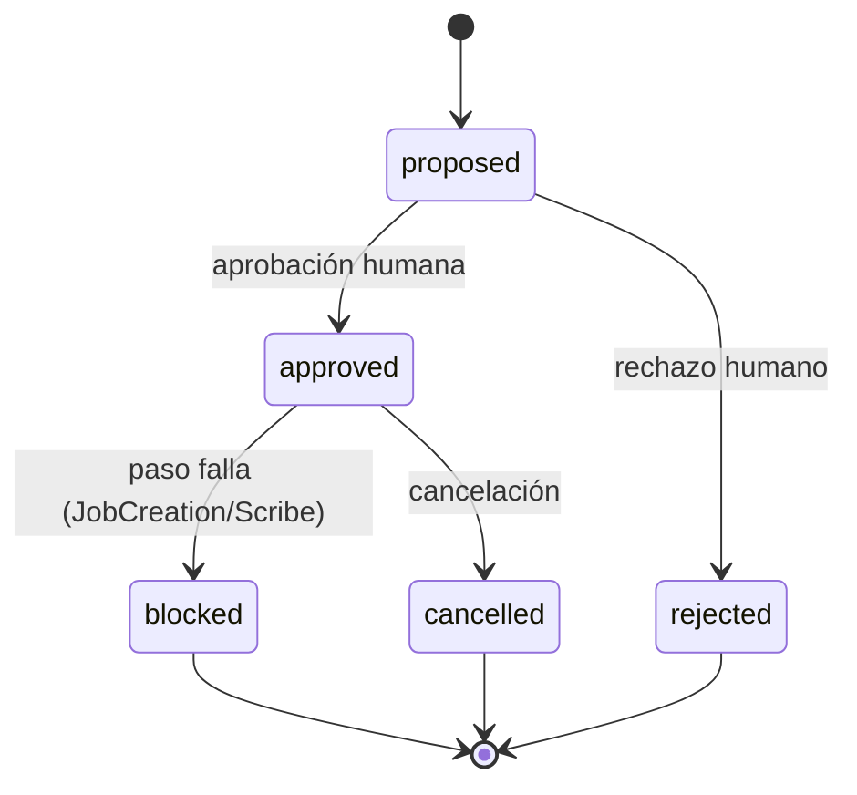
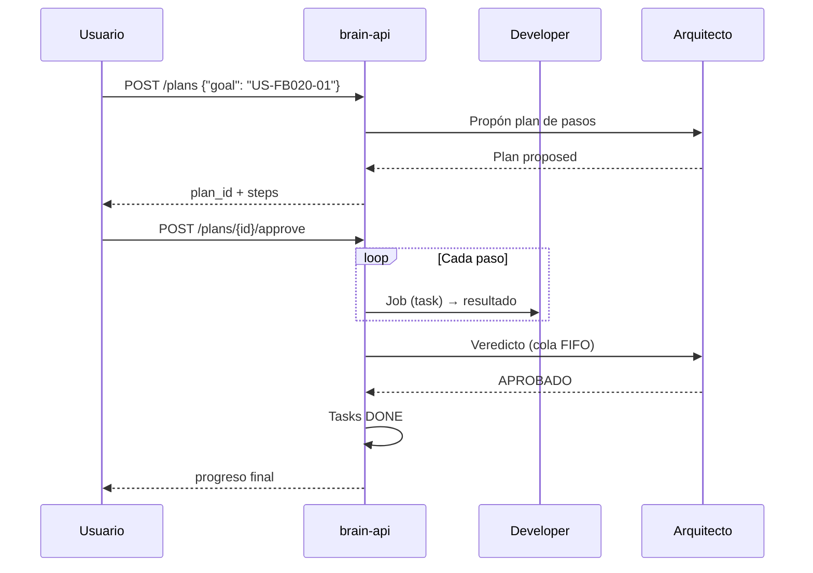

# Jobs y planes

## Ciclo de un Job

Un **Job** es una unidad de trabajo (una descripción de texto) enviada a un agente. Estados:

```
created → running → { completed | failed | cancelled }
```

### Creación (`dispatcher/job_creation.py`)

Precondiciones (cada rechazo lanza `JobCreationError` con mensaje explícito):
- Sesión activa.
- El agente pertenece a la sesión.
- El agente está `idle` (un agente `working` no recibe un Job nuevo).

### Despacho (`dispatcher/job_dispatch.py`)

Mecanismo de **reporte cooperativo** (no shell-end-marker ni heurísticas de silencio):

1. `mark_running(job)` + `mark_working(agent)`.
2. Se añade a la descripción una instrucción: el agente debe escribir su resultado completo en un fichero temporal único (`factory-brain-job-<uuid>.txt`) y una **marca final** (`___FACTORY_BRAIN_JOB_DONE___`) en su propia línea.
3. La instrucción se envía al pane tmux del agente (`run_command`).
4. El dispatcher hace polling del fichero (timeout 30s por defecto), con reintentos de lectura para `OSError` transitorios.
5. `completed` (resultado leído) | `failed` (timeout `JobReportTimeoutError`) | `cancelled` (`JobCancelledError` si el usuario pidió cancelación).
6. En `finally`: borra el fichero temporal y limpia la solicitud de cancelación. El agente vuelve a `idle`.

!!! note "Limitación conocida"
    El despacho depende de que el agente siga la instrucción de reporte. `POST /jobs` es bloqueante: la respuesta HTTP llega cuando el Job termina.

### Scribe pre-procesamiento

Antes de enviar, `_resolve_job_description` puede enriquecer la descripción con contexto de Scribe (por tamaño o conteo) — ver [Runtime y Scribe](runtime.md). `job.description` nunca se muta.

## Encadenado de Jobs

El encadenado es **manual y explícito** (v1; no hay pipeline declarativo):

- Al crear un Job con `previous_job_id`, el resultado del Job anterior (debe estar `completed` y con resultado no vacío) se inyecta **literalmente** en la descripción del nuevo.
- **Guardia de rol**: Developer→Developer está bloqueado — "el resultado de un Developer debe encadenarse a un Critic" (Arquitecto). El resto de combinaciones están permitidas.
- Uso primario: Developer produce → se encadena al Critic/Arquitecto para revisión.

## Histórico y reportes

- `GET /jobs` devuelve el histórico completo de la sesión (nunca se purga).
- `write_job_report(job)` persiste un **informe de cierre** por `job_id` en `07-informes/<story_id>/<job_id>.md` (mecanismo del pipeline backlog-céntrico). Si el Job no tiene `story_id`, va a `07-informes/_sin-story/`.

## Cancelación de Jobs

- `POST /jobs/{job_id}/cancel` solo válido sobre un Job `running` (`JobCancellationRejectedError` en caso contrario).
- Mecanismo: `request_cancellation` fija un `threading.Event`; la transición real a `cancelled` la hace el hilo despachador en su siguiente ciclo de polling. Así se evita escritura concurrente sobre `job.status`.
- **No mata el proceso tmux**: el runtime puede seguir pensando (limitación documentada).
- El endpoint espera (hasta 5s) la transición real y devuelve el estado confirmado.

## Planes del Arquitecto

### Propuesta (`job_plan_builder.py`)

`build_job_plan_for_story(story_id)` escanea `02-backlog/tasks/T-<US>-*.md`, conserva las Tasks `TODO`, las ordena por correlativo y crea un paso por Task. El mecanismo de cada paso se infiere del texto de la Task:

| Si la Task contiene… | mechanism |
|---|---|
| `script`, `automatización` | `script` (no-op degradado; no hay catálogo de scripts en el plan) |
| `scribe` | `scribe` (lo ejecuta Scribe) |
| cualquier otra cosa | `agent` con `agent_role: developer` |

El plan nace en `proposed`. **No se despacha nada hasta la aprobación humana.**

### Aprobación (`job_plan_approval.py`)

Una única decisión de plan completo: `approve` → `approved`, `reject` → `rejected`. No existe aprobación por paso.

### Despacho (`job_plan_dispatch.py`)

`dispatch_plan(plan, session)` (requiere `approved`):

- Itera los pasos en orden. Cada paso: `pending → running → completed | failed | cancelled`.
- **Paso agent**: encuentra el agente por rol (y `agent_id` opcional, para desambiguar con varios Developers), crea el Job con `story_id = plan.goal`, lo registra como activo del plan, lo despacha y escribe el informe de cierre.
- **Paso scribe**: `summarize_document`; `ScribeUnavailableError` es fallo duro del paso.
- **Paso script**: degradado a no-op (se queda `pending`, no bloquea).
- Si un paso falla con `JobCreationError`/`ScribeUnavailableError` → paso `failed`, plan → `blocked`, se detiene.
- Si el usuario cancela (evento) → paso `cancelled`, plan → `cancelled`.
- Un plan completamente despachado permanece en `approved` (no hay estado terminal "completado").

### Veredicto automatico del pipeline (FB-022)

Tras despachar un plan (si no está cancelado), `trigger_architect_verdict` encola un **Job de veredicto** al Arquitecto en una **cola FIFO** (un único worker daemon — el Arquitecto nunca revisa dos cosas a la vez):

1. El worker recoge los informes de cierre de `07-informes/<story_id>/`.
2. Despacha el veredicto al Arquitecto con el formato estructurado:
   ```
   ESTADO: APROBADO | APROBADO_CON_OBSERVACIONES | RECHAZADO
   JUSTIFICACIÓN: <2-4 líneas>
   SIGUIENTE_PROMPT_PARA_WORKER: <prompt>
   ```
3. Se parsea el veredicto:
   - `APROBADO` / `APROBADO_CON_OBSERVACIONES` → marca las Tasks de la Story como `DONE`.
   - `RECHAZADO` → persiste `07-informes/<story_id>/_rechazo.md` con la justificación y el siguiente prompt.

`get_verdict_queue_status()` expone `{active, waiting}`.

## Diagrama de estados de un plan



## Flujo completo recomendado



## Planificado (no implementado)

- **Dispatcher v2 completo** (FB-008): pipeline con dependencias declarativas, cola de Jobs, reintentos, coordinación multiagente automática y resolución de capacidades (vía FB-010 Capability Engine).
- **Scheduler / cola global de Jobs**: no existe como entidad separada hoy.
