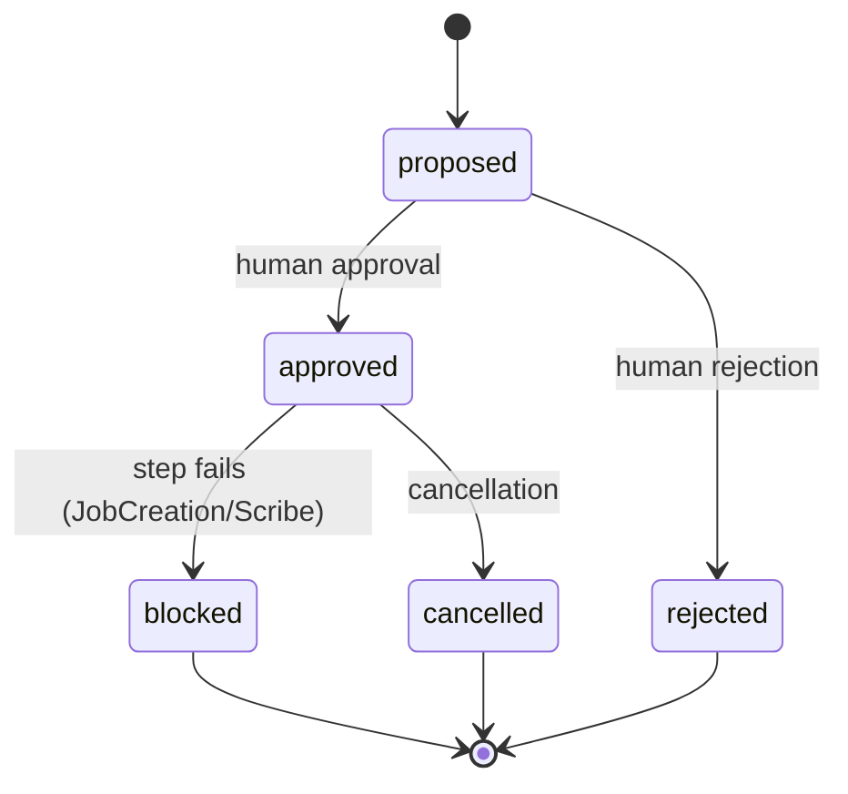
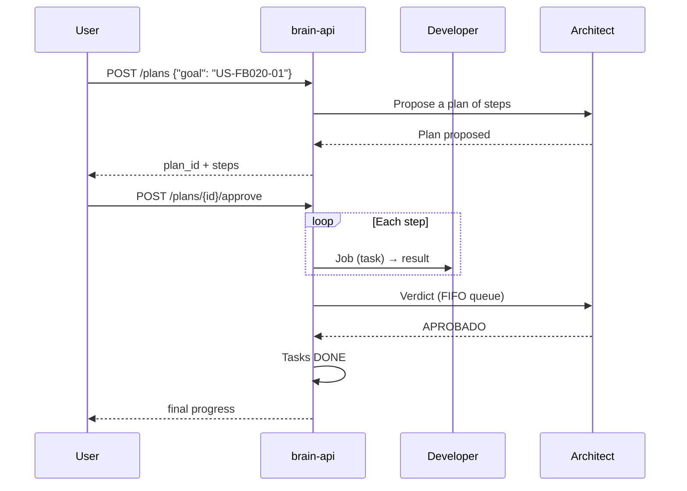

# Jobs and plans

## Job lifecycle

A **Job** is a unit of work (a text description) sent to an agent. States:

```
created → running → { completed | failed | cancelled }
```

### Creation (`dispatcher/job_creation.py`)

Preconditions (each rejection raises `JobCreationError` with an explicit message):
- Active session.
- The agent belongs to the session.
- The agent is `idle` (a `working` agent does not receive a new Job).

### Dispatch (`dispatcher/job_dispatch.py`)

**Cooperative reporting** mechanism (not shell-end-marker nor silence heuristics):

1. `mark_running(job)` + `mark_working(agent)`.
2. An instruction is added to the description: the agent must write its full result to a unique temp file (`factory-brain-job-<uuid>.txt`) plus a **final marker** (`___FACTORY_BRAIN_JOB_DONE___`) on its own line.
3. The instruction is sent to the agent's tmux pane (`run_command`).
4. The dispatcher polls the file (timeout 30s by default), with read retries for transient `OSError`s.
5. `completed` (result read) | `failed` (timeout `JobReportTimeoutError`) | `cancelled` (`JobCancelledError` if the user requested cancellation).
6. In `finally`: deletes the temp file and clears the cancellation request. The agent returns to `idle`.

!!! note "Known limitation"
    Dispatch depends on the agent following the reporting instruction. `POST /jobs` is blocking: the HTTP response arrives when the Job finishes.

### Scribe pre-processing

Before sending, `_resolve_job_description` may enrich the description with Scribe context (by size or count) — see [Runtime and Scribe](runtime.md). `job.description` is never mutated.

## Job chaining

Chaining is **manual and explicit** (v1; there is no declarative pipeline):

- When creating a Job with `previous_job_id`, the previous Job's result (must be `completed` and with a non-empty result) is injected **literally** into the new Job's description.
- **Role guard**: Developer→Developer is blocked — "a Developer result must be chained to a Critic" (Architect). All other combinations are allowed.
- Primary use: Developer produces → chained to Critic/Architect for review.

## History and reports

- `GET /jobs` returns the full session history (never purged).
- `write_job_report(job)` persists a **closing report** per `job_id` in `07-informes/<story_id>/<job_id>.md` (mechanism of the backlog-centric pipeline). If the Job has no `story_id`, it goes to `07-informes/_sin-story/`.

## Job cancellation

- `POST /jobs/{job_id}/cancel` is only valid on a `running` Job (`JobCancellationRejectedError` otherwise).
- Mechanism: `request_cancellation` sets a `threading.Event`; the actual transition to `cancelled` is made by the dispatcher thread in its next polling cycle. This avoids concurrent writes on `job.status`.
- **Does not kill the tmux process**: the runtime may keep thinking (documented limitation).
- The endpoint waits (up to 5s) for the real transition and returns the confirmed state.

## Architect plans

### Proposal (`job_plan_builder.py`)

`build_job_plan_for_story(story_id)` scans `02-backlog/tasks/T-<US>-*.md`, keeps `TODO` Tasks, orders them by correlative and creates one step per Task. Each step's mechanism is inferred from the Task text:

| If the Task contains… | mechanism |
|---|---|
| `script`, `automatización` | `script` (degraded no-op; there is no script catalog in the plan) |
| `scribe` | `scribe` (Scribe runs it) |
| anything else | `agent` with `agent_role: developer` |

The plan is born `proposed`. **Nothing is dispatched until human approval.**

### Approval (`job_plan_approval.py`)

A single whole-plan decision: `approve` → `approved`, `reject` → `rejected`. There is no per-step approval.

### Dispatch (`job_plan_dispatch.py`)

`dispatch_plan(plan, session)` (requires `approved`):

- Iterates the steps in order. Each step: `pending → running → completed | failed | cancelled`.
- **agent step**: finds the agent by role (and optional `agent_id`, to disambiguate among several Developers), creates the Job with `story_id = plan.goal`, registers it as active for the plan, dispatches it and writes the closing report.
- **scribe step**: `summarize_document`; `ScribeUnavailableError` is a hard step failure.
- **script step**: degraded to no-op (stays `pending`, does not block).
- If a step fails with `JobCreationError`/`ScribeUnavailableError` → step `failed`, plan → `blocked`, stops.
- If the user cancels (event) → step `cancelled`, plan → `cancelled`.
- A fully dispatched plan stays `approved` (there is no terminal "completed" state).

### Automatic pipeline verdict (FB-022)

After dispatching a plan (if not cancelled), `trigger_architect_verdict` queues a **verdict Job** to the Architect in a **FIFO queue** (a single daemon worker — the Architect never reviews two things at once):

1. The worker collects the closing reports from `07-informes/<story_id>/`.
2. Dispatches the verdict to the Architect with the structured format:
   ```
   ESTADO: APROBADO | APROBADO_CON_OBSERVACIONES | RECHAZADO
   JUSTIFICACIÓN: <2-4 lines>
   SIGUIENTE_PROMPT_PARA_WORKER: <prompt>
   ```
3. The verdict is parsed:
   - `APROBADO` / `APROBADO_CON_OBSERVACIONES` → marks the Story's Tasks as `DONE`.
   - `RECHAZADO` → persists `07-informes/<story_id>/_rechazo.md` with the justification and the next prompt.

`get_verdict_queue_status()` exposes `{active, waiting}`.

## Plan state diagram



## Recommended full flow



## Planned (not implemented)

- **Full Dispatcher v2** (FB-008): pipeline with declarative dependencies, Job queue, retries, automatic multi-agent coordination and capability resolution (via FB-010 Capability Engine).
- **Scheduler / global Job queue**: does not exist as a separate entity today.
